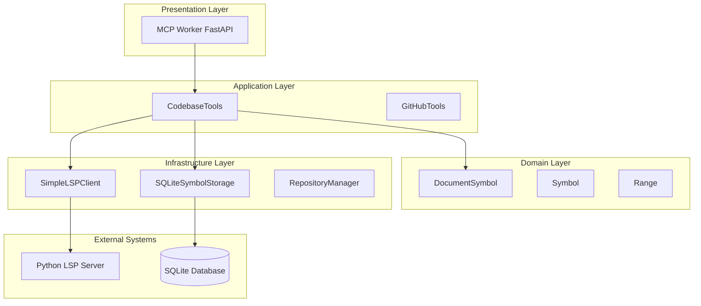
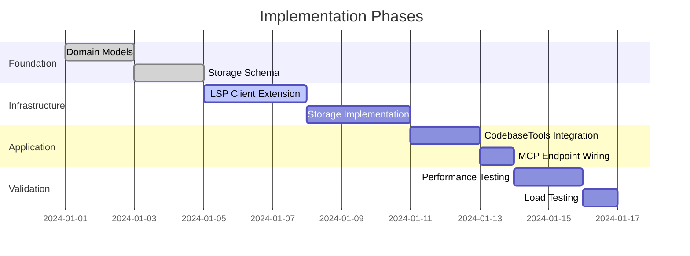

# Architect Design Document

## Feature: ### 1. Document Symbol Hierarchy (`textDocument/documentSymbol`)

#### Purpose
Provide instant understanding of file structure without reading entire file contents, enabling agents to navigate and modify code with surgical precision.

#### Data Returned
- Hierarchical tree of all symbols in a document
- Each symbol includes: name, kind (class/function/method/property), range (start/end positions), detail string, children symbols
- Preserves nesting relationships (methods inside classes, inner functions, nested classes)

#### Agent Usage Patterns

**File Understanding:**
- Agent receives task: "Add a new method to UserAuthentication class"
- Instead of reading entire 1000-line file, agent queries document symbols
- Gets back structure showing UserAuthentication class at lines 145-455, with existing methods listed
- Agent knows exactly where to insert new method without grep or full file read

**Impact Analysis:**
- Before modifying a class, agent can see all its methods/properties instantly
- Can identify if a method already exists with similar name
- Understands class boundaries for proper indentation and placement

**Navigation Optimization:**
- Agent can jump directly to relevant code sections
- Provides "table of contents" for large files
- Enables questions like "What methods does this class have?" without file reading

#### Storage Requirements
- Symbols linked to file versions/timestamps
- Hierarchical parent-child relationships preserved
- Range information for precise positioning
- Must invalidate when file changes

## Agent Role: Architect

# Document Symbol Hierarchy Feature - Architectural Design Document

## 1. Executive Summary

This architectural design proposes implementing the Document Symbol Hierarchy feature (`textDocument/documentSymbol`) for the GitHub Agent MCP Server. The feature will provide hierarchical code structure information to AI agents, enabling precise code navigation without full file reads. 

**Key Architectural Decisions:**
- **Layered Architecture Extension**: Integrate with existing master-worker MCP architecture
- **Hybrid Storage Strategy**: Combine LSP real-time queries with SQLite caching for performance
- **Protocol-Driven Design**: Full LSP 3.17 protocol compliance for `textDocument/documentSymbol`
- **Dependency Injection Pattern**: Maintain existing DI patterns for testability and extensibility

## 2. Codebase Analysis

### 2.1 Current Architecture Assessment

The system implements a **distributed master-worker architecture** with clear separation of concerns:

```
┌─────────────────┐
│   MCP Master    │───► Process Orchestration
└────────┬────────┘
         │ spawns
    ┌────▼────┐
    │ Workers │───► Repository-Isolated Processes
    └────┬────┘
         │ uses
┌────────▼────────────────────────┐
│  SimpleLSPClient (Stateless)    │───► Fresh subprocess per request
├──────────────────────────────────┤
│  AbstractSymbolStorage          │───► SQLite with WAL mode
├──────────────────────────────────┤
│  CodebaseTools                  │───► MCP Tool Registry
└──────────────────────────────────┘
```

**Architectural Strengths Identified:**
- **Process Isolation**: Each repository runs in dedicated worker process
- **Stateless LSP Design**: No persistent connections, high reliability
- **Abstract Interfaces**: Clean dependency boundaries via ABC pattern
- **Robust Storage**: SQLite with retry logic and WAL mode

### 2.2 Integration Patterns Analysis

**Dependency Injection Architecture:**
```python
CodebaseTools(
    repository_manager: AbstractRepositoryManager,  # Configuration
    symbol_storage: AbstractSymbolStorage,         # Persistence
    lsp_client_factory: LSPClientFactory          # LSP Creation
)
```

**Key Pattern**: Factory + Abstract Base Classes instead of mocking libraries

## 3. Integration Points

### 3.1 Architectural Boundaries



### 3.2 Component Responsibilities

| Layer | Component | Responsibility | Integration Point |
|-------|-----------|---------------|-------------------|
| **Presentation** | `mcp_worker.py` | HTTP/JSON-RPC endpoint | Existing tool registry |
| **Application** | `codebase_tools.py` | Tool orchestration | New `find_document_symbols` method |
| **Domain** | `document_symbol_types.py` | Symbol hierarchy model | New domain objects |
| **Infrastructure** | `simple_lsp_client.py` | LSP protocol | New `get_document_symbols` method |
| **Infrastructure** | `symbol_storage.py` | Persistence | Extended schema with hierarchy |

## 4. Detailed Design

### 4.1 System Architecture

```
┌──────────────────────────────────────────────────────┐
│                  MCP Request Flow                     │
└──────────────────────────────────────────────────────┘
                           │
                           ▼
        ┌──────────────────────────────────┐
        │    1. MCP Worker Endpoint        │
        │    POST /mcp/tools/call          │
        │    {"name": "find_document_..."}│
        └──────────────────────────────────┘
                           │
                           ▼
        ┌──────────────────────────────────┐
        │    2. CodebaseTools Router       │
        │    Dependency Resolution         │
        │    Cache Strategy Decision       │
        └──────────────────────────────────┘
                           │
              ┌────────────┴────────────┐
              ▼                         ▼
    ┌─────────────────┐       ┌─────────────────┐
    │ 3a. Cache Hit   │       │ 3b. Cache Miss  │
    │ SQLite Storage  │       │ LSP Client      │
    └─────────────────┘       └─────────────────┘
              │                         │
              │                         ▼
              │               ┌─────────────────┐
              │               │ 4. LSP Server   │
              │               │ Parse & Return  │
              │               └─────────────────┘
              │                         │
              │                         ▼
              │               ┌─────────────────┐
              │               │ 5. Cache Update │
              │               └─────────────────┘
              │                         │
              └────────────┬────────────┘
                           ▼
        ┌──────────────────────────────────┐
        │    6. Response Formatting        │
        │    Hierarchical JSON Response    │
        └──────────────────────────────────┘
```

### 4.2 Data Flow Architecture

**Request Processing Pipeline:**

```python
# Architectural Flow Implementation
class DocumentSymbolPipeline:
    """Represents the data flow through the system."""
    
    async def process_request(self, request: DocumentSymbolRequest) -> DocumentSymbolResponse:
        # 1. Validate Request (Presentation Layer)
        validated = self.validate_mcp_request(request)
        
        # 2. Check Cache (Infrastructure Layer)
        if validated.use_cache:
            cached = await self.storage.get_document_symbols(
                validated.file_path,
                validated.repository_id
            )
            if cached:
                return self.format_response(cached, source="cache")
        
        # 3. Query LSP (Infrastructure Layer)
        lsp_result = await self.lsp_client.get_document_symbols(
            validated.file_uri
        )
        
        # 4. Transform to Domain Model (Domain Layer)
        domain_symbols = self.transform_to_domain(lsp_result)
        
        # 5. Persist to Cache (Infrastructure Layer)
        await self.storage.insert_document_symbols(
            validated.file_path,
            validated.repository_id,
            domain_symbols
        )
        
        # 6. Format Response (Presentation Layer)
        return self.format_response(domain_symbols, source="lsp")
```

### 4.3 Storage Architecture

**Hierarchical Schema Design:**

```sql
-- Extended Symbol Table with Hierarchy Support
CREATE TABLE symbols_v2 (
    id INTEGER PRIMARY KEY AUTOINCREMENT,
    
    -- Core Identity
    name TEXT NOT NULL,
    kind TEXT NOT NULL,
    repository_id TEXT NOT NULL,
    file_path TEXT NOT NULL,
    
    -- Hierarchy
    parent_id INTEGER REFERENCES symbols_v2(id) ON DELETE CASCADE,
    depth INTEGER DEFAULT 0,  -- Optimization for tree queries
    path TEXT,                -- Materialized path for ancestors
    
    -- Position Information
    start_line INTEGER NOT NULL,
    start_character INTEGER NOT NULL,
    end_line INTEGER NOT NULL,
    end_character INTEGER NOT NULL,
    
    -- Selection Range (where name appears)
    selection_start_line INTEGER,
    selection_start_character INTEGER,
    selection_end_line INTEGER,
    selection_end_character INTEGER,
    
    -- Metadata
    detail TEXT,
    docstring TEXT,
    created_at TIMESTAMP DEFAULT CURRENT_TIMESTAMP,
    updated_at TIMESTAMP DEFAULT CURRENT_TIMESTAMP,
    
    -- Version tracking for cache invalidation
    file_hash TEXT,
    lsp_version TEXT
);

-- Performance Indexes
CREATE INDEX idx_symbols_v2_hierarchy ON symbols_v2(file_path, parent_id, depth);
CREATE INDEX idx_symbols_v2_repository ON symbols_v2(repository_id, file_path);
CREATE INDEX idx_symbols_v2_parent ON symbols_v2(parent_id);
CREATE INDEX idx_symbols_v2_path ON symbols_v2(path);
```

**Query Optimization Strategies:**

```python
class HierarchicalSymbolStorage:
    """Optimized storage for hierarchical symbols."""
    
    def get_document_symbols_optimized(self, file_path: str, repository_id: str):
        """Retrieve symbols with single query using recursive CTE."""
        query = """
        WITH RECURSIVE symbol_tree AS (
            -- Anchor: root symbols (no parent)
            SELECT id, name, kind, parent_id, depth, 
                   start_line, start_character, end_line, end_character,
                   detail, 0 as level
            FROM symbols_v2
            WHERE file_path = ? AND repository_id = ? AND parent_id IS NULL
            
            UNION ALL
            
            -- Recursive: children of current level
            SELECT s.id, s.name, s.kind, s.parent_id, s.depth,
                   s.start_line, s.start_character, s.end_line, s.end_character,
                   s.detail, st.level + 1
            FROM symbols_v2 s
            INNER JOIN symbol_tree st ON s.parent_id = st.id
        )
        SELECT * FROM symbol_tree ORDER BY start_line, level;
        """
        return self.execute_query(query, (file_path, repository_id))
```

### 4.4 Scalability Considerations

**Performance Architecture:**

```python
class SymbolCacheStrategy:
    """Cache invalidation and performance optimization."""
    
    def __init__(self):
        self.cache_ttl = 3600  # 1 hour
        self.max_file_size = 10 * 1024 * 1024  # 10MB
        self.batch_size = 100  # Symbols per transaction
        
    async def should_refresh_cache(self, file_path: str, cached_entry: CacheEntry) -> bool:
        """Intelligent cache invalidation."""
        # Check file modification time
        file_mtime = os.path.getmtime(file_path)
        if file_mtime > cached_entry.cached_at:
            return True
            
        # Check TTL
        if time.time() - cached_entry.cached_at > self.cache_ttl:
            return True
            
        # Check file hash for content changes
        current_hash = self.compute_file_hash(file_path)
        if current_hash != cached_entry.file_hash:
            return True
            
        return False
```

**Load Distribution:**

```
┌─────────────────────────────────────┐
│         Load Balancing              │
└─────────────────────────────────────┘
           │
           ▼
┌──────────────────┐
│  Master Process  │
│  (Port Router)   │
└──────────────────┘
           │
    ┌──────┴──────┬──────────┬────────┐
    ▼             ▼          ▼        ▼
┌────────┐  ┌────────┐  ┌────────┐  ┌────────┐
│Worker 1│  │Worker 2│  │Worker 3│  │Worker N│
│Port 8001│ │Port 8002│ │Port 8003│ │Port 800N│
└────────┘  └────────┘  └────────┘  └────────┘
    │           │           │           │
    ▼           ▼           ▼           ▼
┌────────┐  ┌────────┐  ┌────────┐  ┌────────┐
│ SQLite │  │ SQLite │  │ SQLite │  │ SQLite │
│  WAL   │  │  WAL   │  │  WAL   │  │  WAL   │
└────────┘  └────────┘  └────────┘  └────────┘
```

Each worker maintains its own SQLite connection pool with WAL mode enabled for concurrent reads.

## 5. Implementation Plan

### 5.1 Phased Architecture Rollout



### 5.2 Architectural Milestones

| Phase | Components | Architectural Focus |
|-------|------------|-------------------|
| **Phase 1: Domain Foundation** | `document_symbol_types.py` | Domain model integrity |
| **Phase 2: Infrastructure** | LSP client, Storage layer | Protocol compliance, persistence |
| **Phase 3: Application** | CodebaseTools integration | Service orchestration |
| **Phase 4: Presentation** | MCP endpoint | API contract |
| **Phase 5: Optimization** | Caching, indexing | Performance architecture |

## 6. Risk Assessment

### 6.1 Architectural Risks

| Risk | Impact | Mitigation Strategy |
|------|--------|-------------------|
| **LSP Protocol Breaking Changes** | High | Version negotiation, fallback to older protocol |
| **Cache Coherency Issues** | Medium | File hash validation, TTL-based invalidation |
| **Database Lock Contention** | Medium | WAL mode, connection pooling, read replicas |
| **Memory Pressure (Large Files)** | Medium | Streaming parser, pagination, file size limits |
| **Network Latency (LSP Calls)** | Low | Aggressive caching, batch requests |

### 6.2 Architectural Mitigation Patterns

**Circuit Breaker Pattern:**
```python
class LSPCircuitBreaker:
    """Prevent cascading failures in LSP communication."""
    
    def __init__(self, failure_threshold=5, recovery_timeout=60):
        self.failure_count = 0
        self.failure_threshold = failure_threshold
        self.recovery_timeout = recovery_timeout
        self.last_failure_time = None
        self.state = "CLOSED"  # CLOSED, OPEN, HALF_OPEN
    
    async def call(self, func, *args, **kwargs):
        if self.state == "OPEN":
            if self._should_attempt_reset():
                self.state = "HALF_OPEN"
            else:
                raise CircuitOpenError("LSP circuit breaker is open")
        
        try:
            result = await func(*args, **kwargs)
            self._on_success()
            return result
        except Exception as e:
            self._on_failure()
            raise
```

**Bulkhead Pattern:**
```python
class ResourceIsolation:
    """Isolate resources to prevent total system failure."""
    
    def __init__(self):
        # Separate connection pools
        self.lsp_pool = asyncio.Queue(maxsize=10)
        self.db_pool = asyncio.Queue(maxsize=20)
        
        # Separate thread pools
        self.lsp_executor = ThreadPoolExecutor(max_workers=5)
        self.db_executor = ThreadPoolExecutor(max_workers=10)
```

## 7. Security Architecture

### 7.1 Security Boundaries

```
┌──────────────────────────────────────────┐
│          Security Perimeter              │
├──────────────────────────────────────────┤
│  • Input Validation (MCP Layer)          │
│  • Path Traversal Prevention             │
│  • SQL Injection Prevention              │
│  • Process Isolation (Worker Level)      │
└──────────────────────────────────────────┘
```

### 7.2 Security Controls

```python
class SecurityValidator:
    """Input validation and sanitization."""
    
    def validate_file_path(self, file_path: str, repository_root: str) -> str:
        """Prevent path traversal attacks."""
        # Resolve to absolute path
        abs_path = os.path.abspath(os.path.join(repository_root, file_path))
        
        # Ensure path is within repository
        if not abs_path.startswith(os.path.abspath(repository_root)):
            raise SecurityError(f"Path traversal detected: {file_path}")
        
        # Check file exists and is readable
        if not os.path.isfile(abs_path):
            raise FileNotFoundError(f"File not found: {file_path}")
        
        return abs_path
```

## 8. Monitoring and Observability

### 8.1 Metrics Architecture

```python
class DocumentSymbolMetrics:
    """Comprehensive metrics for monitoring."""
    
    def __init__(self):
        self.metrics = {
            # Performance metrics
            "lsp_request_duration": Histogram(),
            "cache_hit_ratio": Gauge(),
            "symbols_per_file": Histogram(),
            
            # Error metrics
            "lsp_errors": Counter(),
            "cache_errors": Counter(),
            "validation_errors": Counter(),
            
            # Business metrics
            "files_processed": Counter(),
            "symbols_extracted": Counter(),
            "cache_size_bytes": Gauge()
        }
```

### 8.2 Logging Strategy

```python
# Structured logging for observability
logger.info("document_symbol_request", extra={
    "repository_id": repository_id,
    "file_path": file_path,
    "cache_hit": cache_hit,
    "symbol_count": len(symbols),
    "duration_ms": duration * 1000,
    "source": "cache" if cache_hit else "lsp"
})
```

## 9. Conclusion

This architectural design ensures:

1. **Architectural Integrity**: Seamless integration with existing master-worker architecture
2. **Performance Scalability**: Hierarchical caching with intelligent invalidation
3. **Reliability**: Circuit breakers, bulkheads, and graceful degradation
4. **Maintainability**: Clear layer boundaries and dependency injection
5. **Observability**: Comprehensive metrics and structured logging

The design leverages existing architectural patterns while introducing minimal complexity, ensuring the Document Symbol Hierarchy feature enhances the system's capability to provide precise code navigation for AI agents.

---
*Generated by Architect agent in parallel design exploration phase*
