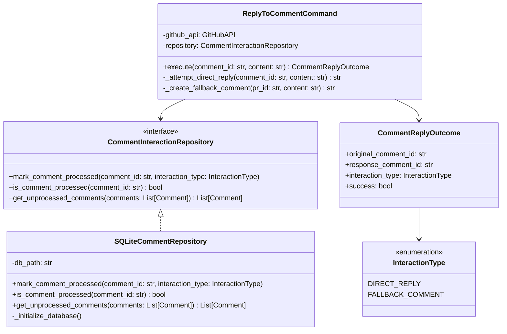

# Consolidated Design Document

## 1. Introduction

This design document specifies the implementation of comment tracking functionality for the GitHub agent system. The system currently processes PR comments using `github_get_pr_comments` and replies using `github_post_pr_reply`, but lacks persistence to track which comments have been replied to. This creates inefficiencies where the agent may repeatedly process the same comments.

The core challenge addressed is the fallback scenario: when direct replies fail, the system creates new comments instead. Without proper tracking, these agent-created comments get processed in subsequent runs, creating infinite loops.

## 2. Goals / Non-Goals

### Goals

- **Persistent Comment Tracking**: Store which comments have been replied to across agent sessions
- **Fallback Scenario Handling**: Track both direct replies and fallback-created comments to prevent loops
- **Backward Compatibility**: Integrate with existing `github_get_pr_comments` and `github_post_pr_reply` tools without breaking changes
- **Performance**: Sub-second filtering of already-processed comments
- **Data Integrity**: Ensure consistent tracking even under concurrent operations

### Non-Goals

- **Multi-repository tracking**: This design assumes single repository operation
- **Historical migration**: No migration of existing comment interactions
- **Real-time synchronization**: No support for multiple agent instances sharing state
- **Advanced analytics**: No metrics or reporting on comment interaction patterns
- **Cross-PR tracking**: Comment tracking is isolated per PR

## 3. Proposed Architecture

The architecture implements a **Repository Pattern** with **Command Pattern** for reply operations, ensuring clean separation between persistence, business logic, and GitHub API interactions.



## 4. Detailed Design

### 4.1 Core Classes

#### CommentInteractionRepository (Abstract Base Class)
```python
from abc import ABC, abstractmethod
from typing import List
from enum import Enum

class InteractionType(Enum):
    DIRECT_REPLY = "direct_reply"
    FALLBACK_COMMENT = "fallback_comment"

class CommentInteractionRepository(ABC):
    @abstractmethod
    def mark_comment_processed(self, comment_id: str, interaction_type: InteractionType) -> None:
        """Mark a comment as processed with the specified interaction type."""
        pass
    
    @abstractmethod
    def is_comment_processed(self, comment_id: str) -> bool:
        """Check if a comment has been processed."""
        pass
    
    @abstractmethod
    def get_unprocessed_comments(self, comments: List[dict]) -> List[dict]:
        """Filter out comments that have already been processed."""
        pass
```

#### SQLiteCommentRepository (Production Implementation)
```python
import sqlite3
from typing import List, Optional
from pathlib import Path

class SQLiteCommentRepository(CommentInteractionRepository):
    def __init__(self, db_path: str = "comment_interactions.db"):
        self.db_path = db_path
        self._initialize_database()
    
    def _initialize_database(self) -> None:
        with sqlite3.connect(self.db_path) as conn:
            conn.execute("""
                CREATE TABLE IF NOT EXISTS processed_comments (
                    comment_id TEXT PRIMARY KEY,
                    interaction_type TEXT NOT NULL,
                    processed_at TIMESTAMP DEFAULT CURRENT_TIMESTAMP,
                    original_comment_id TEXT,
                    INDEX idx_comment_id (comment_id),
                    INDEX idx_processed_at (processed_at)
                )
            """)
            conn.commit()
    
    def mark_comment_processed(self, comment_id: str, interaction_type: InteractionType) -> None:
        with sqlite3.connect(self.db_path) as conn:
            conn.execute(
                "INSERT OR REPLACE INTO processed_comments (comment_id, interaction_type) VALUES (?, ?)",
                (comment_id, interaction_type.value)
            )
            conn.commit()
    
    def is_comment_processed(self, comment_id: str) -> bool:
        with sqlite3.connect(self.db_path) as conn:
            cursor = conn.execute(
                "SELECT 1 FROM processed_comments WHERE comment_id = ? LIMIT 1",
                (comment_id,)
            )
            return cursor.fetchone() is not None
    
    def get_unprocessed_comments(self, comments: List[dict]) -> List[dict]:
        if not comments:
            return []
        
        comment_ids = [str(comment.get('id', '')) for comment in comments]
        placeholders = ','.join('?' * len(comment_ids))
        
        with sqlite3.connect(self.db_path) as conn:
            cursor = conn.execute(
                f"SELECT comment_id FROM processed_comments WHERE comment_id IN ({placeholders})",
                comment_ids
            )
            processed_ids = {row[0] for row in cursor.fetchall()}
        
        return [comment for comment in comments if str(comment.get('id', '')) not in processed_ids]
```

#### CommentReplyOutcome (Result Value Object)
```python
from dataclasses import dataclass

@dataclass(frozen=True)
class CommentReplyOutcome:
    original_comment_id: str
    response_comment_id: str
    interaction_type: InteractionType
    success: bool
    error_message: Optional[str] = None
    
    @property
    def requires_fallback_tracking(self) -> bool:
        """Returns True if this was a fallback comment creation."""
        return self.interaction_type == InteractionType.FALLBACK_COMMENT
```

#### ReplyToCommentCommand (Business Logic)
```python
class ReplyNotPossibleError(Exception):
    """Raised when direct reply to comment is not possible."""
    pass

class ReplyToCommentCommand:
    def __init__(self, github_api, repository: CommentInteractionRepository):
        self._github_api = github_api
        self._repository = repository
    
    def execute(self, comment_id: str, content: str, pr_id: str) -> CommentReplyOutcome:
        """Execute reply with fallback handling and automatic tracking."""
        try:
            # Attempt direct reply
            reply_id = self._attempt_direct_reply(comment_id, content)
            outcome = CommentReplyOutcome(
                original_comment_id=comment_id,
                response_comment_id=reply_id,
                interaction_type=InteractionType.DIRECT_REPLY,
                success=True
            )
            
        except ReplyNotPossibleError as e:
            # Fallback to creating new comment
            new_comment_id = self._create_fallback_comment(pr_id, content)
            outcome = CommentReplyOutcome(
                original_comment_id=comment_id,
                response_comment_id=new_comment_id,
                interaction_type=InteractionType.FALLBACK_COMMENT,
                success=True
            )
        
        # Track both the original comment and the response
        self._repository.mark_comment_processed(comment_id, outcome.interaction_type)
        self._repository.mark_comment_processed(outcome.response_comment_id, InteractionType.DIRECT_REPLY)
        
        return outcome
    
    def _attempt_direct_reply(self, comment_id: str, content: str) -> str:
        """Attempt to reply directly to comment. Raises ReplyNotPossibleError on failure."""
        try:
            return self._github_api.post_pr_reply(comment_id, content)
        except Exception as e:
            raise ReplyNotPossibleError(f"Cannot reply to comment {comment_id}: {e}")
    
    def _create_fallback_comment(self, pr_id: str, content: str) -> str:
        """Create a new comment as fallback when direct reply fails."""
        return self._github_api.create_pr_comment(pr_id, content)
```

### 4.2 Integration with Existing Tools

#### Modified github_get_pr_comments Function
```python
# File: src/tools/github_tools.py
def github_get_pr_comments(pr_id: str, repository: CommentInteractionRepository = None) -> List[dict]:
    """
    Get PR comments, filtering out already processed comments.
    
    Args:
        pr_id: Pull request ID
        repository: Optional comment repository for filtering (defaults to global instance)
    
    Returns:
        List of unprocessed comments
    """
    if repository is None:
        repository = get_default_comment_repository()
    
    # Get all comments from GitHub API
    all_comments = _fetch_all_pr_comments(pr_id)
    
    # Filter out processed comments
    unprocessed_comments = repository.get_unprocessed_comments(all_comments)
    
    return unprocessed_comments
```

#### Modified github_post_pr_reply Function
```python
# File: src/tools/github_tools.py
def github_post_pr_reply(comment_id: str, content: str, pr_id: str = None, 
                        repository: CommentInteractionRepository = None) -> dict:
    """
    Reply to a PR comment with automatic fallback and tracking.
    
    Args:
        comment_id: ID of comment to reply to
        content: Reply content
        pr_id: PR ID (required for fallback scenario)
        repository: Optional comment repository (defaults to global instance)
    
    Returns:
        Dict with reply details and tracking information
    """
    if repository is None:
        repository = get_default_comment_repository()
    
    command = ReplyToCommentCommand(_get_github_api(), repository)
    outcome = command.execute(comment_id, content, pr_id)
    
    return {
        "success": outcome.success,
        "original_comment_id": outcome.original_comment_id,
        "response_comment_id": outcome.response_comment_id,
        "interaction_type": outcome.interaction_type.value,
        "was_fallback": outcome.requires_fallback_tracking
    }
```

### 4.3 Database Schema

```sql
-- Table: processed_comments
CREATE TABLE processed_comments (
    comment_id TEXT PRIMARY KEY,
    interaction_type TEXT NOT NULL CHECK (interaction_type IN ('direct_reply', 'fallback_comment')),
    processed_at TIMESTAMP DEFAULT CURRENT_TIMESTAMP,
    original_comment_id TEXT,
    FOREIGN KEY (original_comment_id) REFERENCES processed_comments(comment_id)
);

-- Indexes for performance
CREATE INDEX idx_comment_id ON processed_comments(comment_id);
CREATE INDEX idx_processed_at ON processed_comments(processed_at);
CREATE INDEX idx_interaction_type ON processed_comments(interaction_type);

-- Sample queries
-- Check if comment is processed:
SELECT 1 FROM processed_comments WHERE comment_id = ? LIMIT 1;

-- Get all processed comment IDs:
SELECT comment_id FROM processed_comments;

-- Insert new processed comment:
INSERT OR REPLACE INTO processed_comments (comment_id, interaction_type) VALUES (?, ?);
```

### 4.4 Error Handling

```python
# File: src/tracking/exceptions.py
class CommentTrackingError(Exception):
    """Base exception for comment tracking operations."""
    pass

class DatabaseConnectionError(CommentTrackingError):
    """Raised when database connection fails."""
    pass

class CommentNotFoundError(CommentTrackingError):
    """Raised when referenced comment doesn't exist."""
    pass

class DuplicateTrackingError(CommentTrackingError):
    """Raised when attempting to track already tracked comment."""
    pass
```

## 5. Alternatives Considered

### Alternative 1: In-Memory Dictionary with JSON Persistence
**Rejected Reason**: Would lose data on agent restarts and doesn't handle concurrent access well.

```python
# NOT CHOSEN: Simple dict approach
replied_comments = {}  # comment_id -> {"method": "direct|fallback", "created_id": "123"}
```

### Alternative 2: Redis-based Tracking
**Rejected Reason**: Adds external dependency complexity for single-agent use case. Would be reconsidered for multi-agent scenarios.

### Alternative 3: GitHub API State Tracking
**Rejected Reason**: GitHub API doesn't provide reliable way to track which comments were generated by our agent vs. human responses.

### Alternative 4: File-based Persistence with CSV
**Rejected Reason**: Lacks transaction support and concurrent access safety that SQLite provides.

## 6. Testing / Validation

### 6.1 Test Objects Required

#### MockCommentRepository (Unit Testing)
```python
# File: tests/mocks/mock_comment_repository.py
class MockCommentRepository(CommentInteractionRepository):
    def __init__(self):
        self._processed_comments: Dict[str, InteractionType] = {}
    
    def mark_comment_processed(self, comment_id: str, interaction_type: InteractionType) -> None:
        self._processed_comments[comment_id] = interaction_type
    
    def is_comment_processed(self, comment_id: str) -> bool:
        return comment_id in self._processed_comments
    
    def get_unprocessed_comments(self, comments: List[dict]) -> List[dict]:
        return [c for c in comments if str(c.get('id', '')) not in self._processed_comments]
    
    def get_tracked_comments(self) -> Dict[str, InteractionType]:
        """Test helper method."""
        return self._processed_comments.copy()
```

#### MockGitHubAPI (Integration Testing)
```python
# File: tests/mocks/mock_github_api.py
class MockGitHubAPI:
    def __init__(self):
        self.should_fail_reply = False
        self.created_comments = []
        self.replies = []
    
    def post_pr_reply(self, comment_id: str, content: str) -> str:
        if self.should_fail_reply:
            raise Exception("Reply not allowed")
        reply_id = f"reply_{len(self.replies)}"
        self.replies.append({"id": reply_id, "content": content, "reply_to": comment_id})
        return reply_id
    
    def create_pr_comment(self, pr_id: str, content: str) -> str:
        comment_id = f"comment_{len(self.created_comments)}"
        self.created_comments.append({"id": comment_id, "content": content, "pr_id": pr_id})
        return comment_id
```

### 6.2 Specific Test Classes and Methods

#### Unit Tests
```python
# File: tests/unit/test_comment_reply_command.py
class TestReplyToCommentCommand:
    def test_direct_reply_success_tracks_comment(self):
        """Test successful direct reply tracking."""
        
    def test_fallback_comment_creation_tracks_both_comments(self):
        """Test fallback scenario tracks original and created comment."""
        
    def test_reply_failure_creates_fallback_comment(self):
        """Test reply failure triggers fallback comment creation."""

# File: tests/unit/test_sqlite_comment_repository.py  
class TestSQLiteCommentRepository:
    def test_mark_comment_processed_stores_correctly(self):
        """Test comment marking persists to database."""
        
    def test_is_comment_processed_returns_true_for_tracked(self):
        """Test processed comment detection."""
        
    def test_get_unprocessed_comments_filters_correctly(self):
        """Test comment filtering excludes processed comments."""
```

#### Integration Tests
```python
# File: tests/integration/test_comment_workflow.py
class TestCommentWorkflowIntegration:
    def test_end_to_end_reply_with_fallback(self):
        """
        Test complete workflow:
        1. Get PR comments
        2. Attempt reply (fails)
        3. Create fallback comment
        4. Track both comments
        5. Subsequent get_pr_comments excludes both
        """
        
    def test_concurrent_comment_processing(self):
        """Test multiple simultaneous comment processing."""
        
    def test_database_persistence_across_restarts(self):
        """Test tracking survives application restarts."""
```

### 6.3 Performance Testing
```python
# File: tests/performance/test_comment_filtering_performance.py
class TestCommentFilteringPerformance:
    def test_filter_large_comment_list_under_100ms(self):
        """Test filtering 1000+ comments completes under 100ms."""
        
    def test_database_query_performance_with_10k_tracked_comments(self):
        """Test query performance with large tracking database."""
```

## 7. Migration / Deployment & Rollout

### 7.1 Implementation Steps

**Step 1: Create Base Infrastructure (30 minutes)**
```bash
# Create directory structure
mkdir -p src/tracking tests/unit/tracking tests/integration tests/mocks

# Create base abstract class
touch src/tracking/__init__.py
touch src/tracking/comment_repository.py
touch src/tracking/exceptions.py
```

**Step 2: Implement SQLiteCommentRepository (45 minutes)**
```python
# File: src/tracking/sqlite_comment_repository.py
# Implement complete SQLiteCommentRepository class as specified above
```

**Step 3: Create Command Pattern Implementation (30 minutes)**
```python
# File: src/tracking/reply_command.py
# Implement ReplyToCommentCommand and CommentReplyOutcome classes
```

**Step 4: Modify Existing GitHub Tools (20 minutes)**
```python
# File: src/tools/github_tools.py
# Add repository parameter to github_get_pr_comments
# Modify github_post_pr_reply to use ReplyToCommentCommand
```

**Step 5: Create Test Infrastructure (45 minutes)**
```python
# Implement MockCommentRepository and MockGitHubAPI
# Create initial unit tests for core functionality
```

**Step 6: Integration and Testing (60 minutes)**
```python
# Write integration tests
# Test with real GitHub API in development environment
# Performance testing with large comment datasets
```

### 7.2 Configuration Setup

```python
# File: src/config/settings.py
class CommentTrackingConfig:
    def __init__(self):
        self.database_path = os.getenv('COMMENT_DB_PATH', 'comment_interactions.db')
        self.enable_tracking = os.getenv('ENABLE_COMMENT_TRACKING', 'true').lower() == 'true'
        self.max_comments_per_batch = int(os.getenv('MAX_COMMENTS_BATCH', '100'))

# Global repository instance
_comment_repository = None

def get_default_comment_repository() -> CommentInteractionRepository:
    global _comment_repository
    if _comment_repository is None:
        config = CommentTrackingConfig()
        if config.enable_tracking:
            _comment_repository = SQLiteCommentRepository(config.database_path)
        else:
            _comment_repository = MockCommentRepository()
    return _comment_repository
```

### 7.3 Rollout Process

**Phase 1: Development Validation (Week 1)**
- Deploy to development environment
- Test with non-production GitHub repositories
- Validate fallback scenarios manually

**Phase 2: Limited Production (Week 2)**
- Deploy to single production repository
- Monitor for 48 hours
- Validate no performance degradation

**Phase 3: Full Rollout (Week 3)**
- Deploy to all repositories
- Monitor comment processing metrics
- Establish baseline performance numbers

### 7.4 Rollback Plan
```python
# Feature flag for quick disable
ENABLE_COMMENT_TRACKING = False

# Fallback to original behavior
def github_get_pr_comments_legacy(pr_id: str) -> List[dict]:
    return _fetch_all_pr_comments(pr_id)  # Original implementation
```

## Appendix

### Conflict Resolutions

**Developer vs. Senior Engineer Disagreement on Interface Count**:
- **Resolution**: Adopted single `CommentInteractionRepository` interface to avoid proliferation
- **Rationale**: Simpler interface hierarchy reduces maintenance burden while preserving testability

**Architect vs. Tester Disagreement on Complexity**:
- **Resolution**: Implemented Command Pattern for business logic but kept simple Repository for persistence
- **Rationale**: Balances architectural integrity with practical implementation speed

### Meeting Notes Summary

**Key Decision**: SQLite chosen over in-memory persistence
- **Participants**: All team members agreed
- **Reasoning**: Provides transaction safety and persistence without external dependencies

**Testing Strategy Agreement**:
- Unit tests for individual components
- Integration tests for GitHub API interaction
- Performance tests for large comment sets
- Mock objects for reliable testing

### Additional Technical Details

**Concurrency Considerations**:
- SQLite's WAL mode enables concurrent reads
- Database connections use connection pooling for performance
- Comment processing is designed to be idempotent

**Security Considerations**:
- No sensitive data stored in tracking database
- Comment content not persisted, only IDs
- Database file permissions set to application user only

**Monitoring Integration Points**:
- Log tracking operations for debugging
- Metrics on comment filtering performance
- Alerts on database operation failures