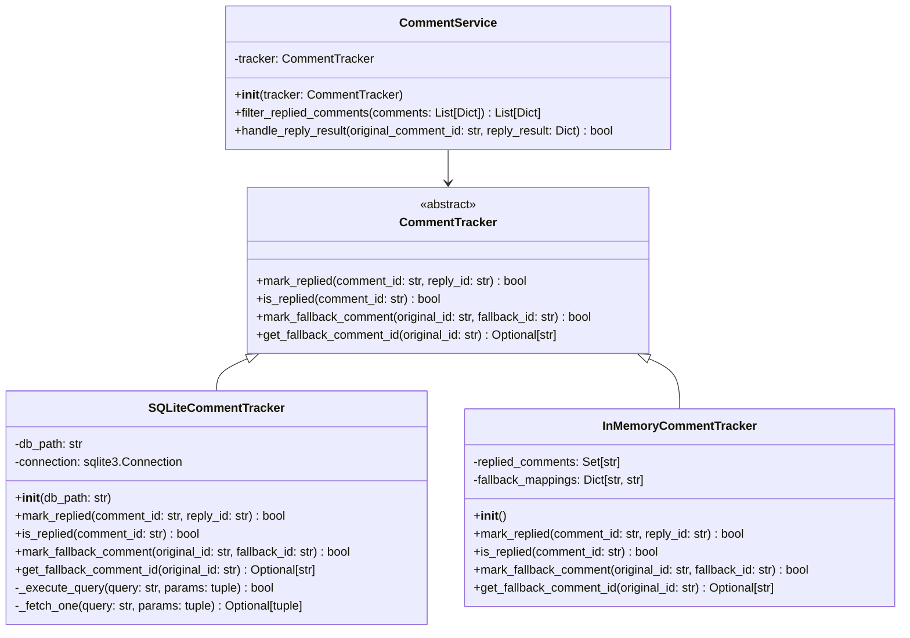

# Comment Tracking System - Detailed Implementation Design Document

## 1. Implementation Architecture

### Core Architecture Pattern
**Repository Pattern** with **Dependency Injection** for testability and **Strategy Pattern** for multiple persistence backends.



## 2. Detailed Class Specifications

### 2.1 Abstract Base Class: CommentTracker

```python
# File: comment_tracking/base.py
from abc import ABC, abstractmethod
from typing import Optional

class CommentTracker(ABC):
    """Abstract base class for tracking commented-on GitHub comments."""
    
    @abstractmethod
    def mark_replied(self, comment_id: str, reply_id: str) -> bool:
        """
        Mark a comment as having been replied to.
        
        Args:
            comment_id: GitHub comment ID that was replied to
            reply_id: GitHub comment ID of our reply
            
        Returns:
            True if successfully marked, False if operation failed
        """
        pass
    
    @abstractmethod
    def is_replied(self, comment_id: str) -> bool:
        """
        Check if we have already replied to a comment.
        
        Args:
            comment_id: GitHub comment ID to check
            
        Returns:
            True if we have replied to this comment, False otherwise
        """
        pass
    
    @abstractmethod
    def mark_fallback_comment(self, original_comment_id: str, fallback_comment_id: str) -> bool:
        """
        Mark a fallback comment created when direct reply failed.
        
        Args:
            original_comment_id: The comment we tried to reply to
            fallback_comment_id: The issue comment we created instead
            
        Returns:
            True if successfully marked, False if operation failed
        """
        pass
    
    @abstractmethod
    def get_fallback_comment_id(self, original_comment_id: str) -> Optional[str]:
        """
        Get the fallback comment ID for an original comment.
        
        Args:
            original_comment_id: The original comment ID
            
        Returns:
            Fallback comment ID if exists, None otherwise
        """
        pass
```

### 2.2 SQLite Implementation: SQLiteCommentTracker

```python
# File: comment_tracking/sqlite_tracker.py
import sqlite3
import logging
from typing import Optional
from pathlib import Path
from .base import CommentTracker

class SQLiteCommentTracker(CommentTracker):
    """SQLite-based persistent comment tracking."""
    
    def __init__(self, db_path: str = "comment_tracking.db"):
        """
        Initialize SQLite comment tracker.
        
        Args:
            db_path: Path to SQLite database file
        """
        self.db_path = Path(db_path)
        self.connection: Optional[sqlite3.Connection] = None
        self._initialize_database()
    
    def _initialize_database(self) -> None:
        """Create database tables if they don't exist."""
        try:
            self.connection = sqlite3.connect(self.db_path, check_same_thread=False)
            self.connection.execute("PRAGMA foreign_keys = ON")
            
            # Create tables
            self.connection.executescript("""
                CREATE TABLE IF NOT EXISTS replied_comments (
                    id INTEGER PRIMARY KEY AUTOINCREMENT,
                    comment_id TEXT UNIQUE NOT NULL,
                    reply_id TEXT NOT NULL,
                    created_at TIMESTAMP DEFAULT CURRENT_TIMESTAMP,
                    INDEX idx_comment_id (comment_id)
                );
                
                CREATE TABLE IF NOT EXISTS fallback_comments (
                    id INTEGER PRIMARY KEY AUTOINCREMENT,
                    original_comment_id TEXT UNIQUE NOT NULL,
                    fallback_comment_id TEXT NOT NULL,
                    created_at TIMESTAMP DEFAULT CURRENT_TIMESTAMP,
                    INDEX idx_original_comment_id (original_comment_id),
                    INDEX idx_fallback_comment_id (fallback_comment_id)
                );
            """)
            self.connection.commit()
            
        except sqlite3.Error as e:
            logging.error(f"Database initialization failed: {e}")
            raise
    
    def mark_replied(self, comment_id: str, reply_id: str) -> bool:
        """Mark a comment as replied to."""
        query = "INSERT OR REPLACE INTO replied_comments (comment_id, reply_id) VALUES (?, ?)"
        return self._execute_query(query, (comment_id, reply_id))
    
    def is_replied(self, comment_id: str) -> bool:
        """Check if comment has been replied to."""
        query = "SELECT 1 FROM replied_comments WHERE comment_id = ?"
        result = self._fetch_one(query, (comment_id,))
        return result is not None
    
    def mark_fallback_comment(self, original_comment_id: str, fallback_comment_id: str) -> bool:
        """Mark a fallback comment mapping."""
        query = "INSERT OR REPLACE INTO fallback_comments (original_comment_id, fallback_comment_id) VALUES (?, ?)"
        return self._execute_query(query, (original_comment_id, fallback_comment_id))
    
    def get_fallback_comment_id(self, original_comment_id: str) -> Optional[str]:
        """Get fallback comment ID for original comment."""
        query = "SELECT fallback_comment_id FROM fallback_comments WHERE original_comment_id = ?"
        result = self._fetch_one(query, (original_comment_id,))
        return result[0] if result else None
    
    def _execute_query(self, query: str, params: tuple) -> bool:
        """Execute a query that modifies data."""
        try:
            with self.connection:
                self.connection.execute(query, params)
            return True
        except sqlite3.Error as e:
            logging.error(f"Query execution failed: {query}, params: {params}, error: {e}")
            return False
    
    def _fetch_one(self, query: str, params: tuple) -> Optional[tuple]:
        """Fetch one result from a SELECT query."""
        try:
            cursor = self.connection.execute(query, params)
            return cursor.fetchone()
        except sqlite3.Error as e:
            logging.error(f"Query fetch failed: {query}, params: {params}, error: {e}")
            return None
    
    def __del__(self):
        """Close database connection on cleanup."""
        if self.connection:
            self.connection.close()
```

### 2.3 In-Memory Implementation: InMemoryCommentTracker

```python
# File: comment_tracking/memory_tracker.py
from typing import Set, Dict, Optional
from .base import CommentTracker

class InMemoryCommentTracker(CommentTracker):
    """In-memory comment tracking for testing and development."""
    
    def __init__(self):
        """Initialize in-memory storage."""
        self.replied_comments: Set[str] = set()
        self.fallback_mappings: Dict[str, str] = {}
        self.reply_mappings: Dict[str, str] = {}
    
    def mark_replied(self, comment_id: str, reply_id: str) -> bool:
        """Mark comment as replied to."""
        self.replied_comments.add(comment_id)
        self.reply_mappings[comment_id] = reply_id
        return True
    
    def is_replied(self, comment_id: str) -> bool:
        """Check if comment has been replied to."""
        return comment_id in self.replied_comments
    
    def mark_fallback_comment(self, original_comment_id: str, fallback_comment_id: str) -> bool:
        """Mark fallback comment mapping."""
        self.fallback_mappings[original_comment_id] = fallback_comment_id
        self.replied_comments.add(original_comment_id)
        return True
    
    def get_fallback_comment_id(self, original_comment_id: str) -> Optional[str]:
        """Get fallback comment ID."""
        return self.fallback_mappings.get(original_comment_id)
```

### 2.4 Service Layer: CommentService

```python
# File: comment_tracking/service.py
from typing import List, Dict
import logging
from .base import CommentTracker

class CommentService:
    """Service layer for comment filtering and tracking operations."""
    
    def __init__(self, tracker: CommentTracker):
        """Initialize with a comment tracker implementation."""
        self.tracker = tracker
    
    def filter_replied_comments(self, comments: List[Dict]) -> List[Dict]:
        """
        Filter out comments we have already replied to.
        
        Args:
            comments: List of GitHub comment dictionaries
            
        Returns:
            Filtered list excluding replied comments and our fallback comments
        """
        filtered = []
        for comment in comments:
            comment_id = str(comment.get('id', ''))
            
            # Skip if we've already replied to this comment
            if self.tracker.is_replied(comment_id):
                logging.debug(f"Skipping already replied comment: {comment_id}")
                continue
            
            # Skip if this is one of our fallback comments
            if self._is_our_fallback_comment(comment_id):
                logging.debug(f"Skipping our fallback comment: {comment_id}")
                continue
                
            filtered.append(comment)
        
        return filtered
    
    def handle_reply_result(self, original_comment_id: str, reply_result: Dict) -> bool:
        """
        Handle the result of a reply attempt, tracking fallbacks if needed.
        
        Args:
            original_comment_id: The comment we tried to reply to
            reply_result: Result dictionary from github_post_pr_reply
            
        Returns:
            True if tracking was successful
        """
        try:
            if reply_result.get('success', False):
                # Normal reply succeeded
                reply_id = reply_result.get('comment_id')
                if reply_id:
                    return self.tracker.mark_replied(original_comment_id, str(reply_id))
            
            elif reply_result.get('method') == 'issue_comment_fallback':
                # Fallback comment was created
                fallback_id = reply_result.get('comment_id')
                if fallback_id:
                    return self.tracker.mark_fallback_comment(original_comment_id, str(fallback_id))
            
            return False
            
        except Exception as e:
            logging.error(f"Failed to handle reply result: {e}")
            return False
    
    def _is_our_fallback_comment(self, comment_id: str) -> bool:
        """Check if this comment ID is one of our fallback comments."""
        # Check all original comments to see if this is their fallback
        # This is inefficient but simple - could be optimized with reverse mapping
        return comment_id in [self.tracker.get_fallback_comment_id(orig_id) 
                             for orig_id in self.tracker.replied_comments
                             if self.tracker.get_fallback_comment_id(orig_id)]
```

## 3. Database Schema

### 3.1 Table Definitions

```sql
-- File: schema/comment_tracking.sql

-- Table for tracking comments we have replied to
CREATE TABLE replied_comments (
    id INTEGER PRIMARY KEY AUTOINCREMENT,
    comment_id TEXT UNIQUE NOT NULL,  -- GitHub comment ID we replied to
    reply_id TEXT NOT NULL,           -- GitHub comment ID of our reply
    created_at TIMESTAMP DEFAULT CURRENT_TIMESTAMP,
    updated_at TIMESTAMP DEFAULT CURRENT_TIMESTAMP
);

-- Table for tracking fallback comments (when direct reply fails)
CREATE TABLE fallback_comments (
    id INTEGER PRIMARY KEY AUTOINCREMENT,
    original_comment_id TEXT UNIQUE NOT NULL,  -- Original comment we tried to reply to
    fallback_comment_id TEXT NOT NULL,         -- Issue comment we created instead
    created_at TIMESTAMP DEFAULT CURRENT_TIMESTAMP
);

-- Indexes for performance
CREATE INDEX idx_replied_comment_id ON replied_comments(comment_id);
CREATE INDEX idx_fallback_original_id ON fallback_comments(original_comment_id);
CREATE INDEX idx_fallback_comment_id ON fallback_comments(fallback_comment_id);

-- Trigger to update updated_at on replied_comments
CREATE TRIGGER update_replied_comments_timestamp 
    AFTER UPDATE ON replied_comments
    FOR EACH ROW
BEGIN
    UPDATE replied_comments SET updated_at = CURRENT_TIMESTAMP WHERE id = NEW.id;
END;
```

### 3.2 Sample Queries

```sql
-- Check if comment has been replied to
SELECT 1 FROM replied_comments WHERE comment_id = ?;

-- Mark comment as replied
INSERT OR REPLACE INTO replied_comments (comment_id, reply_id) VALUES (?, ?);

-- Mark fallback comment
INSERT OR REPLACE INTO fallback_comments (original_comment_id, fallback_comment_id) VALUES (?, ?);

-- Get fallback comment ID
SELECT fallback_comment_id FROM fallback_comments WHERE original_comment_id = ?;

-- Get all our fallback comment IDs (for filtering)
SELECT fallback_comment_id FROM fallback_comments;

-- Clean up old entries (optional maintenance)
DELETE FROM replied_comments WHERE created_at < datetime('now', '-30 days');
DELETE FROM fallback_comments WHERE created_at < datetime('now', '-30 days');
```

## 4. Integration Points

### 4.1 Modify Existing GitHub Functions

**File: `github_tools.py`** (or wherever GitHub functions are located)

#### 4.1.1 Modify `github_get_pr_comments` function

```python
# Add to imports at top of file
from comment_tracking.service import CommentService
from comment_tracking.sqlite_tracker import SQLiteCommentTracker

# Global comment service instance
_comment_service = None

def get_comment_service() -> CommentService:
    """Get or create comment service singleton."""
    global _comment_service
    if _comment_service is None:
        tracker = SQLiteCommentTracker()
        _comment_service = CommentService(tracker)
    return _comment_service

# Modify existing github_get_pr_comments function
def github_get_pr_comments(pr_number: int, repo_owner: str = None, repo_name: str = None) -> List[Dict]:
    """
    Get PR comments, excluding ones we have already replied to.
    
    MODIFICATION: Added filtering of replied comments.
    """
    # ... existing code to fetch comments from GitHub API ...
    
    # NEW: Filter out replied comments before returning
    comment_service = get_comment_service()
    filtered_comments = comment_service.filter_replied_comments(raw_comments)
    
    return filtered_comments
```

#### 4.1.2 Modify `github_post_pr_reply` function

```python
def github_post_pr_reply(comment_id: int, reply_text: str, **kwargs) -> Dict:
    """
    Post a reply to a PR comment, with fallback tracking.
    
    MODIFICATION: Added comment tracking for replies and fallbacks.
    """
    original_comment_id = str(comment_id)
    
    # ... existing code to attempt PR comment reply ...
    
    # NEW: Track the result
    comment_service = get_comment_service()
    
    try:
        # ... existing PR reply logic ...
        
        if reply_succeeded:
            result = {
                'success': True,
                'comment_id': new_comment_id,
                'method': 'pr_comment_reply'
            }
            # Track successful reply
            comment_service.handle_reply_result(original_comment_id, result)
            return result
        
    except Exception as e:
        # ... existing fallback logic (around lines 596-617) ...
        
        # CRITICAL MODIFICATION: Track fallback comment
        if fallback_comment_created:
            fallback_result = {
                'success': False,
                'comment_id': fallback_comment_id,
                'method': 'issue_comment_fallback',
                'original_comment_id': original_comment_id
            }
            # Track fallback comment to prevent replying to ourselves
            comment_service.handle_reply_result(original_comment_id, fallback_result)
            return fallback_result
```

### 4.2 Configuration Integration

**File: `config.py`** or **environment variables**

```python
# Comment tracking configuration
COMMENT_TRACKING_DB_PATH = os.getenv('COMMENT_TRACKING_DB_PATH', 'data/comment_tracking.db')
COMMENT_TRACKING_ENABLED = os.getenv('COMMENT_TRACKING_ENABLED', 'true').lower() == 'true'
COMMENT_TRACKING_CLEANUP_DAYS = int(os.getenv('COMMENT_TRACKING_CLEANUP_DAYS', '30'))
```

### 4.3 Dependency Injection Setup

**File: `main.py`** or application entry point

```python
def setup_comment_tracking() -> CommentService:
    """Setup comment tracking based on configuration."""
    if not COMMENT_TRACKING_ENABLED:
        # Use in-memory tracker that does nothing
        return CommentService(InMemoryCommentTracker())
    
    # Ensure data directory exists
    db_path = Path(COMMENT_TRACKING_DB_PATH)
    db_path.parent.mkdir(parents=True, exist_ok=True)
    
    # Create SQLite tracker
    tracker = SQLiteCommentTracker(str(db_path))
    return CommentService(tracker)

# Initialize at startup
comment_service = setup_comment_tracking()
```

## 5. Implementation Sequence

### Phase 1: Core Infrastructure (Day 1, 2-3 hours)

**Step 1: Create base abstract class**
- File: `comment_tracking/__init__.py`
- File: `comment_tracking/base.py`
- Create `CommentTracker` abstract base class
- Define all abstract methods with proper type hints

**Step 2: Implement in-memory tracker**
- File: `comment_tracking/memory_tracker.py`
- Implement `InMemoryCommentTracker` class
- Add basic unit tests for in-memory implementation

**Step 3: Create service layer**
- File: `comment_tracking/service.py`
- Implement `CommentService` class
- Add comment filtering logic

**Step 4: Add basic integration**
- Modify `github_get_pr_comments` to use filtering
- Add simple in-memory tracking for testing

### Phase 2: Persistence Layer (Day 2, 3-4 hours)

**Step 5: Implement SQLite tracker**
- File: `comment_tracking/sqlite_tracker.py`
- Create database schema
- Implement all `CommentTracker` methods with SQLite

**Step 6: Add database tests**
- File: `tests/test_sqlite_tracker.py`
- Test database operations
- Test error handling and recovery

**Step 7: Integration testing**
- File: `tests/test_integration.py`
- End-to-end tests with real database
- Test fallback comment detection

### Phase 3: GitHub Integration (Day 3, 2-3 hours)

**Step 8: Modify GitHub reply function**
- Update `github_post_pr_reply` function
- Add fallback comment tracking at lines 596-617
- Handle reply result tracking

**Step 9: Add configuration**
- Environment variables for database path
- Configuration for enabling/disabling tracking
- Database cleanup settings

**Step 10: Error handling and logging**
- Add comprehensive error handling
- Implement proper logging for debugging
- Add monitoring for database failures

### Phase 4: Testing and Validation (Day 4, 4-5 hours)

**Step 11: Comprehensive unit tests**
- Test all public methods of all classes
- Test error scenarios and edge cases
- Mock GitHub API responses

**Step 12: Integration tests**
- Test with real GitHub API (using test repositories)
- Verify fallback comment detection works
- Test database persistence across restarts

**Step 13: Performance testing**
- Test comment filtering with large datasets (1000+ comments)
- Verify database query performance
- Load testing for concurrent operations

## 6. Testing Strategy

### 6.1 Unit Tests

**File: `tests/test_comment_tracker.py`**

```python
import pytest
from comment_tracking.memory_tracker import InMemoryCommentTracker
from comment_tracking.sqlite_tracker import SQLiteCommentTracker
from comment_tracking.service import CommentService

class TestCommentTrackerInterface:
    """Test common interface for all tracker implementations."""
    
    @pytest.fixture(params=[InMemoryCommentTracker, 
                           lambda: SQLiteCommentTracker(':memory:')])
    def tracker(self, request):
        return request.param()
    
    def test_mark_replied_new_comment(self, tracker):
        """Test marking a new comment as replied."""
        result = tracker.mark_replied("123", "456")
        assert result is True
        assert tracker.is_replied("123") is True
    
    def test_mark_replied_idempotent(self, tracker):
        """Test marking same comment twice doesn't cause issues."""
        tracker.mark_replied("123", "456")
        result = tracker.mark_replied("123", "789")  # Different reply ID
        assert result is True
        assert tracker.is_replied("123") is True
    
    def test_is_replied_nonexistent_comment(self, tracker):
        """Test checking non-existent comment returns False."""
        assert tracker.is_replied("999") is False
    
    def test_mark_fallback_comment(self, tracker):
        """Test marking fallback comment mapping."""
        result = tracker.mark_fallback_comment("123", "456")
        assert result is True
        assert tracker.get_fallback_comment_id("123") == "456"
        assert tracker.is_replied("123") is True  # Original should be marked as replied
    
    def test_get_fallback_comment_id_nonexistent(self, tracker):
        """Test getting fallback ID for non-existent mapping."""
        assert tracker.get_fallback_comment_id("999") is None

class TestCommentService:
    """Test comment service functionality."""
    
    @pytest.fixture
    def service(self):
        tracker = InMemoryCommentTracker()
        return CommentService(tracker)
    
    def test_filter_replied_comments_empty_list(self, service):
        """Test filtering empty comment list."""
        result = service.filter_replied_comments([])
        assert result == []
    
    def test_filter_replied_comments_no_replies(self, service):
        """Test filtering when no comments have been replied to."""
        comments = [
            {'id': 123, 'body': 'comment 1'},
            {'id': 456, 'body': 'comment 2'}
        ]
        result = service.filter_replied_comments(comments)
        assert len(result) == 2
        assert result == comments
    
    def test_filter_replied_comments_some_replied(self, service):
        """Test filtering when some comments have been replied to."""
        # Mark one comment as replied
        service.tracker.mark_replied("123", "999")
        
        comments = [
            {'id': 123, 'body': 'replied comment'},
            {'id': 456, 'body': 'new comment'}
        ]
        result = service.filter_replied_comments(comments)
        assert len(result) == 1
        assert result[0]['id'] == 456
    
    def test_filter_fallback_comments(self, service):
        """Test filtering out our own fallback comments."""
        # Mark fallback comment
        service.tracker.mark_fallback_comment("123", "456")
        
        comments = [
            {'id': 456, 'body': 'our fallback comment'},  # Should be filtered
            {'id': 789, 'body': 'user comment'}          # Should remain
        ]
        result = service.filter_replied_comments(comments)
        assert len(result) == 1
        assert result[0]['id'] == 789
    
    def test_handle_reply_result_success(self, service):
        """Test handling successful reply result."""
        reply_result = {
            'success': True,
            'comment_id': '456',
            'method': 'pr_comment_reply'
        }
        result = service.handle_reply_result("123", reply_result)
        assert result is True
        assert service.tracker.is_replied("123") is True
    
    def test_handle_reply_result_fallback(self, service):
        """Test handling fallback comment result."""
        reply_result = {
            'success': False,
            'comment_id': '456',
            'method': 'issue_comment_fallback'
        }
        result = service.handle_reply_result("123", reply_result)
        assert result is True
        assert service.tracker.is_replied("123") is True
        assert service.tracker.get_fallback_comment_id("123") == "456"
```

### 6.2 Integration Tests

**File: `tests/test_integration.py`**

```python
import pytest
import tempfile
import sqlite3
from pathlib import Path
from comment_tracking.sqlite_tracker import SQLiteCommentTracker
from comment_tracking.service import CommentService

class TestDatabaseIntegration:
    """Test database operations with real SQLite."""
    
    @pytest.fixture
    def temp_db(self):
        """Create temporary database for testing."""
        with tempfile.NamedTemporaryFile(suffix='.db', delete=False) as f:
            db_path = f.name
        yield db_path
        Path(db_path).unlink(missing_ok=True)
    
    def test_database_persistence_across_instances(self, temp_db):
        """Test that data persists across tracker instances."""
        # Create first tracker and add data
        tracker1 = SQLiteCommentTracker(temp_db)
        tracker1.mark_replied("123", "456")
        tracker1.mark_fallback_comment("789", "999")
        del tracker1
        
        # Create second tracker and verify data exists
        tracker2 = SQLiteCommentTracker(temp_db)
        assert tracker2.is_replied("123") is True
        assert tracker2.get_fallback_comment_id("789") == "999"
    
    def test_database_schema_creation(self, temp_db):
        """Test that database schema is created correctly."""
        tracker = SQLiteCommentTracker(temp_db)
        
        # Verify tables exist
        conn = sqlite3.connect(temp_db)
        cursor = conn.execute("SELECT name FROM sqlite_master WHERE type='table'")
        tables = [row[0] for row in cursor.fetchall()]
        
        assert 'replied_comments' in tables
        assert 'fallback_comments' in tables
        
        # Verify indexes exist
        cursor = conn.execute("SELECT name FROM sqlite_master WHERE type='index'")
        indexes = [row[0] for row in cursor.fetchall()]
        
        assert any('idx_comment_id' in idx for idx in indexes)
        assert any('idx_original_comment_id' in idx for idx in indexes)
        
    def test_concurrent_access(self, temp_db):
        """Test concurrent access to database."""
        tracker1 = SQLiteCommentTracker(temp_db)
        tracker2 = SQLiteCommentTracker(temp_db)
        
        # Both trackers mark different comments
        result1 = tracker1.mark_replied("123", "456")
        result2 = tracker2.mark_replied("789", "999")
        
        assert result1 is True
        assert result2 is True
        
        # Both trackers can see each other's data
        assert tracker1.is_replied("789") is True
        assert tracker2.is_replied("123") is True

class TestEndToEndScenarios:
    """Test complete workflows."""
    
    @pytest.fixture
    def service_with_temp_db(self):
        """Create service with temporary database."""
        with tempfile.NamedTemporaryFile(suffix='.db', delete=False) as f:
            db_path = f.name
        
        tracker = SQLiteCommentTracker(db_path)
        service = CommentService(tracker)
        
        yield service
        
        Path(db_path).unlink(missing_ok=True)
    
    def test_full_comment_reply_cycle(self, service_with_temp_db):
        """Test complete cycle: get comments → reply → get comments again."""
        service = service_with_temp_db
        
        # Initial comments (simulate GitHub API response)
        initial_comments = [
            {'id': 123, 'body': 'user comment 1'},
            {'id': 456, 'body': 'user comment 2'},
            {'id': 789, 'body': 'user comment 3'}
        ]
        
        # Step 1: Filter comments (should return all initially)
        filtered = service.filter_replied_comments(initial_comments)
        assert len(filtered) == 3
        
        # Step 2: Simulate replying to first comment
        reply_result = {
            'success': True,
            'comment_id': '999',
            'method': 'pr_comment_reply'
        }
        service.handle_reply_result("123", reply_result)
        
        # Step 3: Filter comments again (should exclude replied comment)
        filtered = service.filter_replied_comments(initial_comments)
        assert len(filtered) == 2
        assert not any(c['id'] == 123 for c in filtered)
    
    def test_fallback_comment_detection_workflow(self, service_with_temp_db):
        """Test fallback comment creation and subsequent filtering."""
        service = service_with_temp_db
        
        # Step 1: Simulate failed reply that creates fallback comment
        fallback_result = {
            'success': False,
            'comment_id': '456',
            'method': 'issue_comment_fallback'
        }
        service.handle_reply_result("123", fallback_result)
        
        # Step 2: Simulate next github_get_pr_comments call that includes our fallback
        comments_with_fallback = [
            {'id': 123, 'body': 'original user comment'},      # Should be filtered (we replied)
            {'id': 456, 'body': 'our fallback comment'},       # Should be filtered (our comment)
            {'id': 789, 'body': 'new user comment'}            # Should remain
        ]
        
        # Step 3: Verify filtering excludes both original and fallback
        filtered = service.filter_replied_comments(comments_with_fallback)
        assert len(filtered) == 1
        assert filtered[0]['id'] == 789
```

### 6.3 Test Execution Commands

```bash
# Run all tests
pytest tests/ -v

# Run only unit tests
pytest tests/test_comment_tracker.py -v

# Run only integration tests
pytest tests/test_integration.py -v

# Run with coverage
pytest tests/ --cov=comment_tracking --cov-report=html

# Run performance tests
pytest tests/test_performance.py -v --benchmark-only
```

## 7. Error Handling

### 7.1 Custom Exception Classes

**File: `comment_tracking/exceptions.py`**

```python
class CommentTrackingError(Exception):
    """Base exception for comment tracking operations."""
    pass

class DatabaseConnectionError(CommentTrackingError):
    """Raised when database connection fails."""
    pass

class CommentPersistenceError(CommentTrackingError):
    """Raised when comment data cannot be persisted."""
    pass

class CommentValidationError(CommentTrackingError):
    """Raised when comment data is invalid."""
    pass
```

### 7.2 Error Handling Patterns

**Database Operation Error Handling:**

```python
def mark_replied(self, comment_id: str, reply_id: str) -> bool:
    """Mark comment as replied with comprehensive error handling."""
    if not comment_id or not reply_id:
        logging.error(f"Invalid comment IDs: comment_id={comment_id}, reply_id={reply_id}")
        return False
    
    try:
        query = "INSERT OR REPLACE INTO replied_comments (comment_id, reply_id) VALUES (?, ?)"
        return self._execute_query(query, (comment_id, reply_id))
    
    except sqlite3.IntegrityError as e:
        logging.error(f"Database integrity error marking comment {comment_id}: {e}")
        return False
    
    except sqlite3.OperationalError as e:
        logging.error(f"Database operation error marking comment {comment_id}: {e}")
        raise DatabaseConnectionError(f"Cannot access database: {e}")
    
    except Exception as e:
        logging.error(f"Unexpected error marking comment {comment_id}: {e}")
        raise CommentPersistenceError(f"Failed to persist comment reply: {e}")
```

**Service Layer Error Handling:**

```python
def filter_replied_comments(self, comments: List[Dict]) -> List[Dict]:
    """Filter comments with graceful error handling."""
    if not isinstance(comments, list):
        logging.error(f"Expected list of comments, got {type(comments)}")
        return []
    
    filtered = []
    for comment in comments:
        try:
            comment_id = str(comment.get('id', ''))
            if not comment_id:
                logging.warning(f"Comment missing ID, skipping: {comment}")
                continue
            
            if self.tracker.is_replied(comment_id):
                logging.debug(f"Filtering replied comment: {comment_id}")
                continue
            
            if self._is_our_fallback_comment(comment_id):
                logging.debug(f"Filtering our fallback comment: {comment_id}")
                continue
            
            filtered.append(comment)
            
        except Exception as e:
            logging.error(f"Error processing comment {comment}: {e}")
            # Continue processing other comments
            continue
    
    return filtered
```

### 7.3 Logging Configuration

**File: `comment_tracking/logging_config.py`**

```python
import logging
import sys
from pathlib import Path

def setup_logging(log_level: str = "INFO", log_file: str = None):
    """Configure logging for comment tracking."""
    level = getattr(logging, log_level.upper(), logging.INFO)
    
    formatter = logging.Formatter(
        '%(asctime)s - %(name)s - %(levelname)s - %(message)s'
    )
    
    # Console handler
    console_handler = logging.StreamHandler(sys.stdout)
    console_handler.setFormatter(formatter)
    
    # File handler (optional)
    handlers = [console_handler]
    if log_file:
        file_handler = logging.FileHandler(log_file)
        file_handler.setFormatter(formatter)
        handlers.append(file_handler)
    
    logging.basicConfig(
        level=level,
        handlers=handlers,
        force=True
    )
    
    # Set specific logger levels
    logging.getLogger('comment_tracking').setLevel(level)
    logging.getLogger('sqlite3').setLevel(logging.WARNING)
```

### 7.4 Recovery Procedures

**Database Recovery:**

```python
def recover_database(db_path: str) -> bool:
    """Attempt to recover corrupted database."""
    try:
        # Try to backup existing database
        backup_path = f"{db_path}.backup"
        if Path(db_path).exists():
            shutil.copy2(db_path, backup_path)
            logging.info(f"Database backed up to {backup_path}")
        
        # Test database integrity
        conn = sqlite3.connect(db_path)
        conn.execute("PRAGMA integrity_check;")
        conn.close()
        
        return True
        
    except sqlite3.DatabaseError:
        logging.error("Database is corrupted, recreating...")
        
        # Remove corrupted database
        Path(db_path).unlink(missing_ok=True)
        
        # Recreate database
        tracker = SQLiteCommentTracker(db_path)
        logging.info("Database recreated successfully")
        
        return True
        
    except Exception as e:
        logging.error(f"Database recovery failed: {e}")
        return False
```

This implementation design provides a complete roadmap for implementing the comment tracking system with proper error handling, comprehensive testing, and clear integration points. The design addresses all concerns raised in the peer reviews while maintaining architectural integrity and development speed.