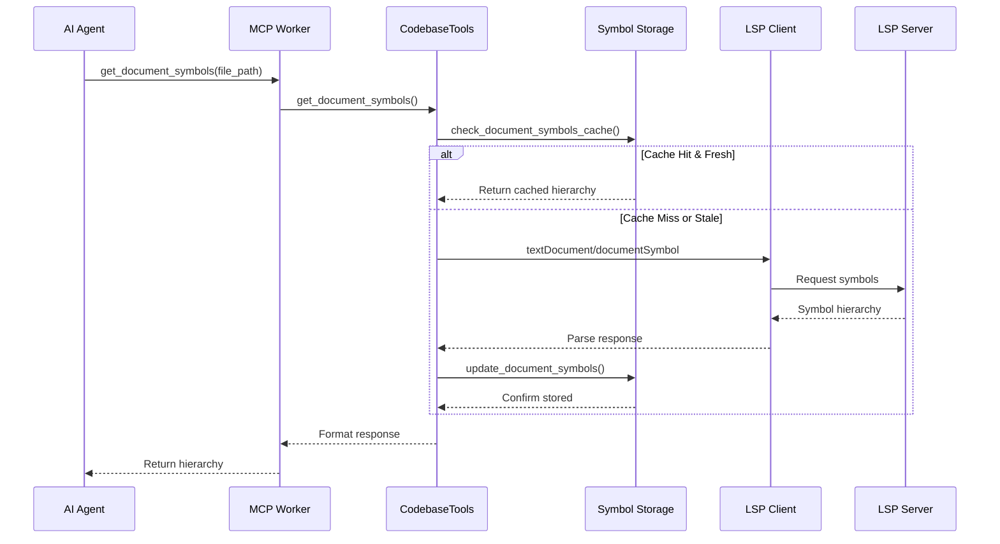

# Document Symbol Hierarchy Feature - Architectural Design

## Executive Summary

This architectural design proposes extending the GitHub Agent MCP Server with a comprehensive Document Symbol Hierarchy feature implementing the LSP `textDocument/documentSymbol` protocol. The feature will provide hierarchical symbol navigation capabilities, enabling AI agents to understand file structure without parsing entire file contents. The design leverages existing LSP infrastructure, extends the current symbol storage schema for hierarchical relationships, and integrates seamlessly with the master-worker architecture.

Key architectural decisions:
- **Hybrid approach**: Real-time LSP queries with intelligent caching
- **Schema evolution**: Backward-compatible extension of existing symbol storage
- **Worker isolation**: Each repository worker maintains independent symbol hierarchies
- **Performance optimization**: Incremental updates and lazy loading strategies

## 1. Codebase Analysis

### 1.1 Existing Architecture Patterns

The codebase demonstrates sophisticated architectural patterns highly relevant to our feature:

#### Master-Worker Architecture
- **MCPMaster** (`mcp_master.py:189-691`): Orchestrates worker processes with health monitoring
- **MCPWorker** (`mcp_worker.py:57-602`): Isolated per-repository MCP protocol handlers
- **Port isolation**: Each repository gets dedicated port for complete isolation

#### LSP Integration Infrastructure
- **Multiple LSP Managers**: `PyrightLSPManager`, `PylspManager` supporting different servers
- **Protocol Support**: Already configured for `documentSymbolProvider` capability
  - `pyright_lsp_manager.py:106`: `"documentSymbolProvider": True`
  - `pylsp_manager.py:112`: `"documentSymbolProvider": True`
- **SimpleLSPClient**: Direct subprocess approach for reliability (`simple_lsp_client.py:14-411`)

#### Symbol Storage System
- **SQLiteSymbolStorage** (`symbol_storage.py:204-800`): Production-ready with retry logic
- **Current Schema**: Flat symbol table without hierarchy support
- **Transaction Management**: Robust error recovery and corruption handling

#### Repository Indexing
- **PythonRepositoryIndexer** (`repository_indexer.py:77-250`): AST-based extraction
- **PythonSymbolExtractor** (`python_symbol_extractor.py:33-350`): Scope-aware parsing
- **Batch Processing**: Handles large repositories with progress tracking

### 1.2 Architectural Boundaries

```
┌─────────────────────────────────────────────────────────┐
│                    MCPMaster Process                      │
│  ┌─────────────────────────────────────────────────┐    │
│  │          Repository Configuration Manager        │    │
│  └─────────────────────────────────────────────────┘    │
└─────────────────────────────────────────────────────────┘
                            │
                ┌───────────┼───────────┐
                ▼           ▼           ▼
┌──────────────────┐ ┌──────────────────┐ ┌──────────────────┐
│  MCPWorker #1    │ │  MCPWorker #2    │ │  MCPWorker #N    │
│  Port: 5100      │ │  Port: 5101      │ │  Port: 510N      │
│                  │ │                  │ │                  │
│ ┌──────────────┐ │ │ ┌──────────────┐ │ │ ┌──────────────┐ │
│ │ LSP Client   │ │ │ │ LSP Client   │ │ │ │ LSP Client   │ │
│ └──────────────┘ │ │ └──────────────┘ │ │ └──────────────┘ │
│ ┌──────────────┐ │ │ ┌──────────────┐ │ │ ┌──────────────┐ │
│ │Symbol Storage│ │ │ │Symbol Storage│ │ │ │Symbol Storage│ │
│ └──────────────┘ │ │ └──────────────┘ │ │ └──────────────┘ │
└──────────────────┘ └──────────────────┘ └──────────────────┘
```

### 1.3 Design Pattern Analysis

**Dependency Injection Pattern**
```python
# codebase_tools.py:69-86
def __init__(self,
    repository_manager: AbstractRepositoryManager,
    symbol_storage: AbstractSymbolStorage,
    lsp_client_factory: LSPClientFactory)
```

**Abstract Factory Pattern**
```python
# codebase_tools.py:49
def create_simple_lsp_client(workspace_root: str, python_path: str) -> SimpleLSPClient
```

**Repository Pattern with Abstraction**
```python
# symbol_storage.py:88-200
class AbstractSymbolStorage(ABC)
class SQLiteSymbolStorage(AbstractSymbolStorage)
```

## 2. Integration Points

### 2.1 Primary Integration Components

| Component | File | Integration Type | Modification Scope |
|-----------|------|-----------------|-------------------|
| **LSP Protocol Layer** | `simple_lsp_client.py` | Extension | Add `get_document_symbols()` method |
| **Symbol Storage** | `symbol_storage.py` | Schema Evolution | Add hierarchy support |
| **Codebase Tools** | `codebase_tools.py` | New Method | Add `get_document_symbols()` tool |
| **MCP Worker** | `mcp_worker.py` | Tool Registration | Register new MCP tool |
| **Symbol Extractor** | `python_symbol_extractor.py` | Enhancement | Extract hierarchy during AST walk |
| **Repository Indexer** | `repository_indexer.py` | Extension | Store hierarchical relationships |

### 2.2 Data Flow Architecture



## 3. Detailed Design

### 3.1 Database Schema Evolution

#### Current Schema
```sql
CREATE TABLE symbols (
    id INTEGER PRIMARY KEY,
    name TEXT NOT NULL,
    kind TEXT NOT NULL,
    file_path TEXT NOT NULL,
    line_number INTEGER NOT NULL,
    column_number INTEGER NOT NULL,
    repository_id TEXT NOT NULL,
    docstring TEXT
)
```

#### Extended Schema with Hierarchy
```sql
-- Main symbols table with hierarchy support
CREATE TABLE symbols_v2 (
    id INTEGER PRIMARY KEY AUTOINCREMENT,

    -- Core Identity (backward compatible)
    name TEXT NOT NULL,
    kind TEXT NOT NULL,
    file_path TEXT NOT NULL,
    line_number INTEGER NOT NULL,
    column_number INTEGER NOT NULL,
    repository_id TEXT NOT NULL,
    docstring TEXT,

    -- Hierarchy Support (new)
    parent_id INTEGER REFERENCES symbols_v2(id) ON DELETE CASCADE,
    depth INTEGER DEFAULT 0,
    path TEXT, -- Materialized path for fast queries

    -- Range Information (new)
    end_line INTEGER,
    end_column INTEGER,

    -- Additional Metadata (new)
    detail TEXT, -- Type info, signatures
    children_count INTEGER DEFAULT 0,

    -- Versioning
    file_hash TEXT,
    indexed_at TIMESTAMP DEFAULT CURRENT_TIMESTAMP,

    -- Indexes for performance
    INDEX idx_parent (parent_id),
    INDEX idx_path (path),
    INDEX idx_file_repo (file_path, repository_id),
    INDEX idx_file_hash (file_hash)
);

-- Document-level cache
CREATE TABLE document_symbols_cache (
    id INTEGER PRIMARY KEY,
    file_path TEXT NOT NULL,
    repository_id TEXT NOT NULL,
    file_hash TEXT NOT NULL,
    symbols_json TEXT NOT NULL, -- Hierarchical JSON
    extracted_at TIMESTAMP DEFAULT CURRENT_TIMESTAMP,
    lsp_server_type TEXT,

    UNIQUE(file_path, repository_id)
);
```

### 3.2 Component Architecture

#### 3.2.1 Enhanced LSP Client

```python
# simple_lsp_client.py extension
class SimpleLSPClient:
    async def get_document_symbols(
        self,
        file_uri: str,
        timeout: float = 10.0
    ) -> list[dict[str, Any]]:
        """Get document symbols with hierarchy.

        Returns LSP DocumentSymbol[] with structure:
        {
            "name": str,
            "detail": str,
            "kind": int (SymbolKind),
            "range": {"start": Position, "end": Position},
            "selectionRange": {"start": Position, "end": Position},
            "children": DocumentSymbol[]
        }
        """
        request = {
            "jsonrpc": "2.0",
            "id": self._next_id(),
            "method": "textDocument/documentSymbol",
            "params": {
                "textDocument": {"uri": file_uri}
            }
        }
        return await self._send_request(request, timeout)
```

#### 3.2.2 Hierarchical Symbol Model

```python
# symbol_storage.py extensions
@dataclass
class HierarchicalSymbol(Symbol):
    """Extended symbol with hierarchy support."""
    parent_id: int | None = None
    depth: int = 0
    path: str = ""  # e.g., "MyClass/my_method/inner_func"
    end_line: int | None = None
    end_column: int | None = None
    detail: str | None = None
    children: list["HierarchicalSymbol"] = field(default_factory=list)

    def to_lsp_format(self) -> dict[str, Any]:
        """Convert to LSP DocumentSymbol format."""
        return {
            "name": self.name,
            "detail": self.detail or "",
            "kind": self._symbol_kind_to_lsp(self.kind),
            "range": {
                "start": {"line": self.line_number, "character": self.column_number},
                "end": {"line": self.end_line or self.line_number,
                       "character": self.end_column or 0}
            },
            "selectionRange": {
                "start": {"line": self.line_number, "character": self.column_number},
                "end": {"line": self.line_number,
                       "character": self.column_number + len(self.name)}
            },
            "children": [child.to_lsp_format() for child in self.children]
        }
```

#### 3.2.3 Enhanced CodebaseTools

```python
# codebase_tools.py extensions
class CodebaseTools:
    async def get_document_symbols(
        self,
        repository_id: str,
        file_path: str,
        use_cache: bool = True,
        force_refresh: bool = False
    ) -> str:
        """Get hierarchical symbols for a document.

        Strategy:
        1. Check cache if enabled and not forcing refresh
        2. Query LSP server for fresh data
        3. Cache results for future queries
        4. Return hierarchical JSON structure
        """
        try:
            repo_config = self.repository_manager.get_repository(repository_id)
            if not repo_config:
                return json.dumps({"error": f"Repository '{repository_id}' not found"})

            workspace_root = repo_config.get("local_path")
            full_path = os.path.join(workspace_root, file_path)

            # Check cache
            if use_cache and not force_refresh:
                cached = self.symbol_storage.get_document_symbols_cache(
                    file_path, repository_id
                )
                if cached and self._is_cache_valid(cached, full_path):
                    return cached.symbols_json

            # Get from LSP
            lsp_client = self.lsp_client_factory(workspace_root, self.python_path)
            file_uri = f"file://{full_path}"

            symbols = await lsp_client.get_document_symbols(file_uri)

            # Process and cache
            hierarchical_symbols = self._process_lsp_symbols(symbols)

            if use_cache:
                self.symbol_storage.cache_document_symbols(
                    file_path,
                    repository_id,
                    hierarchical_symbols,
                    self._get_file_hash(full_path)
                )

            return json.dumps({
                "repository_id": repository_id,
                "file_path": file_path,
                "symbols": hierarchical_symbols,
                "source": "lsp",
                "cached": False
            })

        except Exception as e:
            self.logger.exception(f"Error getting document symbols")
            return json.dumps({
                "error": str(e),
                "repository_id": repository_id,
                "file_path": file_path
            })
```

### 3.3 Performance Architecture

#### 3.3.1 Caching Strategy

**Multi-Level Cache Hierarchy:**
1. **L1 - Memory Cache** (per worker): Recent document symbols (LRU, 100 files)
2. **L2 - SQLite Cache**: Persistent document symbols with file hash validation
3. **L3 - LSP Server**: Fresh data from language server

**Cache Invalidation:**
- File hash comparison on each request
- Git hook integration for file change events
- TTL-based expiry (configurable, default 1 hour)
- Manual refresh via `force_refresh` parameter

#### 3.3.2 Query Optimization

```python
class OptimizedSymbolQueries:
    def get_symbols_in_range(self, file_path: str, start_line: int, end_line: int):
        """Get symbols within a line range using range indexes."""
        return self.db.execute("""
            SELECT * FROM symbols_v2
            WHERE file_path = ?
            AND line_number >= ?
            AND line_number <= ?
            ORDER BY line_number, depth
        """, (file_path, start_line, end_line))

    def get_symbol_at_position(self, file_path: str, line: int, column: int):
        """Find deepest symbol containing position."""
        return self.db.execute("""
            SELECT * FROM symbols_v2
            WHERE file_path = ?
            AND line_number <= ?
            AND end_line >= ?
            AND column_number <= ?
            AND end_column >= ?
            ORDER BY depth DESC
            LIMIT 1
        """, (file_path, line, line, column, column))
```

### 3.4 Scalability Considerations

#### Resource Management
- **Memory**: LRU cache with configurable size limits
- **Storage**: Document symbols cached with automatic cleanup (30 days)
- **CPU**: Lazy loading of child symbols for deep hierarchies
- **Network**: Batch symbol requests for multiple files

#### Concurrency Model
```python
class ConcurrentSymbolProcessor:
    def __init__(self, max_workers: int = 4):
        self.executor = ThreadPoolExecutor(max_workers=max_workers)
        self.semaphore = asyncio.Semaphore(max_workers)

    async def process_multiple_documents(self, documents: list[str]):
        """Process multiple documents concurrently."""
        async with self.semaphore:
            tasks = [self.get_document_symbols(doc) for doc in documents]
            return await asyncio.gather(*tasks, return_exceptions=True)
```

## 4. Implementation Roadmap

### Phase 1: Foundation (Week 1)
**Goal:** Establish core infrastructure

1. **Database Schema Migration**
   - Create migration script for `symbols_v2` table
   - Implement backward compatibility layer
   - Add document cache table

2. **LSP Protocol Extension**
   - Extend `SimpleLSPClient` with `get_document_symbols()`
   - Add response parsing for hierarchical symbols
   - Implement timeout and error handling

3. **Symbol Model Enhancement**
   - Create `HierarchicalSymbol` dataclass
   - Implement conversion methods (to/from LSP format)
   - Add tree traversal utilities

**Deliverables:**
- Migration script: `migrations/add_symbol_hierarchy.py`
- Extended LSP client tests
- Symbol model unit tests

### Phase 2: Core Implementation (Week 2)
**Goal:** Implement primary functionality

1. **Storage Layer Updates**
   - Extend `AbstractSymbolStorage` interface
   - Implement hierarchical storage in `SQLiteSymbolStorage`
   - Add caching methods

2. **CodebaseTools Integration**
   - Add `get_document_symbols()` method
   - Implement cache validation logic
   - Add configuration options

3. **MCP Tool Registration**
   - Register new tool in MCP worker
   - Add tool documentation
   - Implement parameter validation

**Deliverables:**
- Working document symbols API
- Integration tests
- Tool documentation

### Phase 3: Optimization (Week 3)
**Goal:** Performance and reliability

1. **Performance Optimization**
   - Implement memory cache (LRU)
   - Add batch processing support
   - Optimize database queries

2. **Enhanced Indexing**
   - Update `PythonSymbolExtractor` for hierarchy
   - Modify `PythonRepositoryIndexer` for ranges
   - Add incremental indexing support

3. **Error Recovery**
   - Implement fallback to AST parsing
   - Add corruption recovery
   - Enhanced logging and metrics

**Deliverables:**
- Performance benchmarks
- Stress tests
- Monitoring dashboard

### Phase 4: Polish & Extension (Week 4)
**Goal:** Production readiness

1. **Cross-Language Support**
   - Abstract language-specific logic
   - Add TypeScript symbol support
   - Implement generic LSP fallback

2. **Advanced Features**
   - Symbol search within hierarchy
   - Breadcrumb navigation
   - Symbol outline generation

3. **Documentation & Testing**
   - Comprehensive API documentation
   - End-to-end test scenarios
   - Performance documentation

**Deliverables:**
- Complete feature documentation
- Test coverage > 90%
- Performance report

## 5. Risk Assessment

### Technical Risks

| Risk | Impact | Probability | Mitigation Strategy |
|------|--------|-------------|-------------------|
| **LSP Server Incompatibility** | High | Medium | Implement fallback to AST parsing; test multiple LSP servers |
| **Performance Degradation** | High | Low | Multi-level caching; lazy loading; query optimization |
| **Schema Migration Failure** | High | Low | Backup before migration; reversible migrations; gradual rollout |
| **Memory Pressure** | Medium | Medium | Configurable cache sizes; memory monitoring; circuit breakers |
| **Concurrent Access Issues** | Medium | Low | SQLite WAL mode; connection pooling; retry logic |

### Architectural Risks

**1. Backward Compatibility**
- **Risk:** Breaking existing symbol search functionality
- **Mitigation:**
  - Maintain existing APIs unchanged
  - Create new endpoints for hierarchical data
  - Extensive regression testing

**2. Worker Process Isolation**
- **Risk:** Cross-contamination of symbol data
- **Mitigation:**
  - Strict repository_id enforcement
  - Separate database connections per worker
  - Process-level isolation maintained

**3. LSP Server Resource Usage**
- **Risk:** LSP servers consuming excessive resources
- **Mitigation:**
  - Connection pooling and reuse
  - Timeout enforcement
  - Resource monitoring and limits

### Operational Risks

**1. Cache Invalidation Complexity**
- **Risk:** Stale data served to agents
- **Mitigation:**
  - File hash validation
  - Git hook integration
  - Manual refresh capability

**2. Storage Growth**
- **Risk:** Unbounded growth of cache data
- **Mitigation:**
  - Automatic cleanup (30-day TTL)
  - Storage monitoring
  - Configurable retention policies

## 6. Security Considerations

### Access Control
- Maintain existing repository-based access isolation
- No cross-repository symbol access
- Validate all file paths against repository boundaries

### Input Validation
```python
def validate_file_path(self, repository_id: str, file_path: str) -> bool:
    """Ensure file path is within repository boundaries."""
    repo_config = self.repository_manager.get_repository(repository_id)
    workspace_root = repo_config.get("local_path")
    full_path = os.path.abspath(os.path.join(workspace_root, file_path))
    return full_path.startswith(os.path.abspath(workspace_root))
```

### Data Sanitization
- Escape all user inputs in SQL queries (parameterized queries)
- Validate JSON responses from LSP servers
- Sanitize file paths in logs

## 7. Monitoring & Observability

### Key Metrics
```python
class DocumentSymbolMetrics:
    cache_hits: Counter
    cache_misses: Counter
    lsp_requests: Histogram  # Duration
    parse_errors: Counter
    symbols_per_file: Histogram
    hierarchy_depth: Histogram
```

### Logging Strategy
- Structured logging with correlation IDs
- Performance timing for all operations
- Error tracking with context

### Health Checks
```python
async def document_symbols_health_check(self) -> dict:
    return {
        "cache_status": self._check_cache_health(),
        "lsp_status": await self._check_lsp_health(),
        "storage_status": self._check_storage_health(),
        "performance": {
            "avg_response_time_ms": self.metrics.avg_response_time,
            "cache_hit_rate": self.metrics.cache_hit_rate
        }
    }
```

## 8. Testing Strategy

### Unit Tests
- Symbol model serialization/deserialization
- Cache invalidation logic
- Tree traversal algorithms

### Integration Tests
- LSP server communication
- Database operations
- Cache coordination

### End-to-End Tests
```python
async def test_document_symbols_e2e():
    # Setup
    worker = create_test_worker()

    # Test full flow
    response = await worker.handle_mcp_request({
        "method": "tools/call",
        "params": {
            "name": "get_document_symbols",
            "arguments": {
                "repository_id": "test_repo",
                "file_path": "src/main.py"
            }
        }
    })

    # Verify hierarchy
    assert_valid_hierarchy(response["symbols"])
    assert_performance_acceptable(response["timing"])
```

## 9. Configuration

### Environment Variables
```bash
# Feature flags
ENABLE_DOCUMENT_SYMBOLS=true
DOCUMENT_SYMBOLS_CACHE_TTL=3600

# Performance tuning
DOCUMENT_SYMBOLS_CACHE_SIZE=100
DOCUMENT_SYMBOLS_BATCH_SIZE=10
LSP_DOCUMENT_SYMBOLS_TIMEOUT=10

# Storage
DOCUMENT_SYMBOLS_RETENTION_DAYS=30
DOCUMENT_SYMBOLS_MAX_DEPTH=10
```

### Repository Configuration
```json
{
  "repository_id": "my_repo",
  "document_symbols": {
    "enabled": true,
    "cache_strategy": "aggressive",
    "lsp_server": "pyright",
    "fallback_to_ast": true
  }
}
```

## 10. Conclusion

This architectural design provides a robust, scalable, and performant implementation of the Document Symbol Hierarchy feature. By leveraging existing infrastructure and following established patterns, the implementation risk is minimized while delivering significant value to AI agents.

The hybrid approach of real-time LSP queries with intelligent caching ensures optimal performance without sacrificing accuracy. The hierarchical data model enables sophisticated code navigation while maintaining backward compatibility.

Key success factors:
- **Incremental delivery** through phased implementation
- **Risk mitigation** through fallback mechanisms
- **Performance optimization** through multi-level caching
- **Operational excellence** through comprehensive monitoring

The design positions the system for future enhancements including cross-language support, semantic navigation, and advanced code intelligence features.