# MCP Codebase Intelligence Server - Task Breakdown for Symbol Type Information

## Executive Summary

This task breakdown addresses the Symbol Type Information user story with a **phased approach** that validates critical assumptions early while leveraging existing infrastructure. Based on estimation insights, we'll start with a technical spike to assess our foundation, then build incrementally with comprehensive testing.

### Key Decisions Needed
1. **Architecture Validation**: Should we extend existing LSP integration or build new type analysis?
2. **Quality vs Speed**: Focus on comprehensive Python type support (5 points) or reliable basic functionality (3 points)?
3. **Fallback Strategy**: How graceful should degradation be when type information is unavailable?

---

## Task Breakdown

### Phase 1: Foundation & Risk Mitigation

#### Task 1.1: Technical Architecture Spike ⚡ CRITICAL
**Effort**: 0.5 points | **Priority**: P0 | **Timeline**: Days 1-2

**Description**: Validate our ability to extract type information from existing LSP/symbol infrastructure.

**Acceptance Criteria**:
- [ ] Audit current LSP server capabilities for type information extraction
- [ ] Test AST access through existing symbol extraction tools  
- [ ] Document what type data is readily available vs needs new implementation
- [ ] Identify circular dependency handling in current codebase

**Risk Mitigation**: 
- Addresses the "Impact: High - Could double effort" risk from estimation
- Provides early warning system for inadequate foundation

**Questions for Review**:
- Should we proceed with pyright LSP if current tools are inadequate?
- What's the minimum viable type information for first release?

#### Task 1.2: Symbol Type Data Model Design
**Effort**: 0.5 points | **Priority**: P0 | **Timeline**: Day 2

**Description**: Design the data structures and database schema for storing type information.

**Acceptance Criteria**:
- [ ] Define TypeInfo data structure compatible with existing Symbol schema
- [ ] Design storage for function signatures, parameter types, return types
- [ ] Plan class hierarchy storage (inheritance chains, method overrides)
- [ ] Specify fallback data structure for missing type information

**Dependencies**: Requires Task 1.1 completion

---

### Phase 2: Core Implementation

#### Task 2.1: Basic Type Extraction Implementation
**Effort**: 1.5 points | **Priority**: P1 | **Timeline**: Days 3-5

**Description**: Implement core type information extraction using validated approach from spike.

**Acceptance Criteria**:
- [ ] Extract function signatures with parameter names and types
- [ ] Capture return type information where available
- [ ] Handle Python type hints (Union, Optional, Generic types)
- [ ] Extract class method signatures and property types

**Quick-Win Opportunity**: 
- Leverage existing symbol extraction to reduce from 2.5 to 1.5 points
- Reuse existing LSP communication patterns

**Implementation Notes**:
```python
@dataclass
class TypeInfo:
    signature: Optional[str]
    parameters: List[ParameterInfo]
    return_type: Optional[str]
    docstring: Optional[str]
    is_async: bool
    decorators: List[str]
```

#### Task 2.2: Class Hierarchy Analysis
**Effort**: 1.0 points | **Priority**: P1 | **Timeline**: Days 5-6

**Description**: Implement class inheritance and method resolution analysis.

**Acceptance Criteria**:
- [ ] Extract base class relationships
- [ ] Identify method overrides and inheritance chains  
- [ ] Handle multiple inheritance scenarios
- [ ] Track mixin and ABC (Abstract Base Class) relationships

**Risk Mitigation**: 
- Focuses on Python's specific inheritance model complexity
- Includes graceful handling of complex multiple inheritance

#### Task 2.3: MCP Tool Integration
**Effort**: 0.5 points | **Priority**: P1 | **Timeline**: Day 7

**Description**: Expose type information through MCP tool interface.

**Acceptance Criteria**:
- [ ] Implement `get_type_info(symbol, repository_id)` MCP tool
- [ ] Return consistent JSON schema for all type information
- [ ] Handle missing type information gracefully
- [ ] Integrate with existing symbol lookup tools

**API Design Question for Review**:
```typescript
interface TypeInfoResponse {
  symbol: string;
  signature?: string;
  parameters?: ParameterInfo[];
  return_type?: string;
  class_hierarchy?: string[];
  docstring?: string;
  source_location: Location;
}
```
- Is this schema sufficient for agent needs?

---

### Phase 3: Quality & Testing

#### Task 3.1: Comprehensive Test Suite
**Effort**: 1.0 points | **Priority**: P1 | **Timeline**: Days 8-9

**Description**: Build robust test coverage addressing failure modes identified in estimation.

**Acceptance Criteria**:
- [ ] Test circular import dependency handling
- [ ] Validate complex inheritance scenarios (diamond problem, mixins)
- [ ] Test graceful degradation when LSP server fails
- [ ] Verify performance with large codebases (>1000 classes)
- [ ] Test type hint edge cases (Union, Generic, TypeVar)

**Failure Mode Coverage** (from Testing_First analysis):
- Invalid AST nodes causing crashes
- Circular dependencies in type resolution
- Memory leaks during type analysis
- LSP server disconnection during type queries

#### Task 3.2: Performance Optimization
**Effort**: 0.5 points | **Priority**: P2 | **Timeline**: Day 10

**Description**: Optimize type information retrieval for production use.

**Acceptance Criteria**:
- [ ] Implement caching for frequently requested type information
- [ ] Batch type analysis requests to LSP server
- [ ] Add query timeout handling
- [ ] Profile memory usage during type analysis

---

### Phase 4: Production Readiness

#### Task 4.1: Error Handling & Logging
**Effort**: 0.5 points | **Priority**: P2 | **Timeline**: Day 11

**Description**: Implement comprehensive error handling and observability.

**Acceptance Criteria**:
- [ ] Log type analysis failures with context
- [ ] Implement fallback responses for missing type data  
- [ ] Add metrics for type analysis success rates
- [ ] Handle LSP server timeouts gracefully

#### Task 4.2: Documentation & Integration
**Effort**: 0.5 points | **Priority**: P2 | **Timeline**: Day 12

**Description**: Document the type information system and integration patterns.

**Acceptance Criteria**:
- [ ] API documentation for `get_type_info` tool
- [ ] Integration examples for common use cases
- [ ] Troubleshooting guide for type analysis failures
- [ ] Performance characteristics documentation

---

## Risk Mitigation Strategies

### Critical Risk: Inadequate Foundation Infrastructure
- **Mitigation**: Task 1.1 technical spike provides early validation
- **Escalation**: If spike reveals major gaps, pivot to pyright LSP integration
- **Timeline**: Decision point at end of Day 2

### Medium Risk: Complex Python Type System Edge Cases  
- **Mitigation**: Comprehensive test suite (Task 3.1) with real-world scenarios
- **Fallback**: Graceful degradation to basic signature information
- **Monitoring**: Success rate metrics in Task 4.1

### Low Risk: Performance at Scale
- **Mitigation**: Caching and batching in Task 3.2
- **Validation**: Load testing with target repositories

---

## Quick-Win Opportunities

### 🚀 Leverage Existing Symbol Extraction (Potential 1 point savings)
**Assessment in Task 1.1**: If existing tools provide AST access, reduce Task 2.1 effort by 1 point

### 🚀 Reuse LSP Communication Patterns (Time savings)  
**Implementation**: Use established LSP client patterns from existing codebase

### 🚀 Database Schema Extension (Architecture reuse)
**Benefit**: Extend existing Symbol table rather than new storage system

---

## Dependencies & Timeline

```mermaid
gantt
    title Symbol Type Information Implementation
    dateFormat X
    axisFormat %d
    
    section Phase 1
    Architecture Spike    :crit, spike, 0, 2d
    Data Model Design     :model, after spike, 1d
    
    section Phase 2  
    Type Extraction       :impl1, after model, 3d
    Class Hierarchy       :impl2, after impl1, 2d
    MCP Integration       :mcp, after impl2, 1d
    
    section Phase 3
    Test Suite           :test, after mcp, 2d
    Performance          :perf, after test, 1d
    
    section Phase 4
    Error Handling       :error, after perf, 1d  
    Documentation        :docs, after error, 1d
```



**Total Estimate**: 4 points (aligns with consensus)
**Critical Path**: Architecture spike → Core implementation → Testing
**Delivery Milestones**:
- Day 2: Architecture validation complete ✅
- Day 7: Basic type information working ✅  
- Day 10: Production-ready with comprehensive testing ✅

---

## Open Questions for Review

### 🤔 Architecture Decisions
1. **LSP Server Choice**: Should we standardize on pyright for superior type analysis, or maintain flexibility?
2. **Type Information Depth**: How comprehensive should our type analysis be initially? Full Python type system or basic signatures?

### 🤔 Quality vs Speed Trade-offs  
1. **Failure Handling**: Is graceful degradation sufficient, or do we need guaranteed type information?
2. **Performance Requirements**: What's the acceptable response time for type queries? (<200ms, <500ms?)

### 🤔 Integration Patterns
1. **Schema Evolution**: Should TypeInfo be a separate response or embedded in existing symbol data?
2. **Caching Strategy**: Type information changes less frequently—should we cache aggressively?

### 🤔 Testing Strategy
1. **Test Data**: Should we use real-world repositories or synthetic test cases for validation?
2. **Performance Baselines**: What repositories should we use for performance benchmarking?

---

## Implementation Context & Notes

### From Domain Expert Analysis
- Need enterprise-grade compliance with Python type system standards
- Integration with existing MCP patterns is critical for adoption
- Consider backward compatibility with repositories lacking type hints

### From Testing-First Analysis  
- Comprehensive failure mode coverage is essential for reliability
- Graceful degradation prevents system-wide failures
- Performance characteristics must be predictable under load

### Architecture Decision Record
**Decision Point**: After Task 1.1 completion, document the chosen approach:
- Extend existing LSP integration vs new pyright client
- Database schema evolution vs new storage
- Caching strategy for type information

**Tracking**: Create ADR document capturing trade-offs and rationale

---

*This task breakdown enables incremental development with early validation of critical assumptions while maintaining focus on both speed and quality based on the estimation debate insights.*