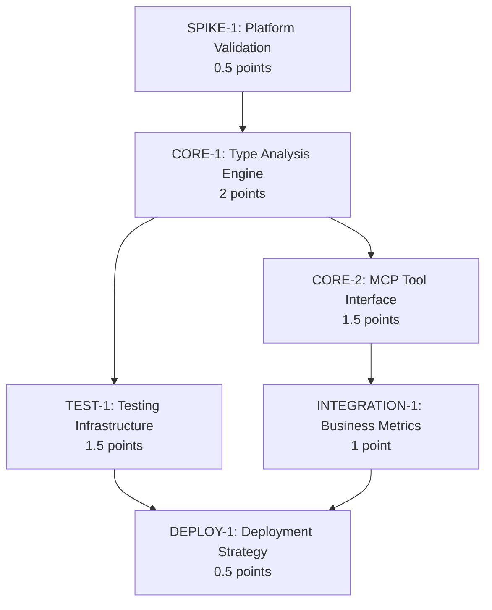

# MCP Codebase Intelligence Server - Task Breakdown for Symbol Type Information

## Executive Summary

This task breakdown creates a **Symbol Type Information** feature for the MCP Codebase Intelligence Server, focusing on Python type analysis and signatures. Based on estimation insights, we're balancing **technical robustness** (testing-first approach) with **business integration needs** (domain expert concerns).

### Key Decisions Needed 📋
- **Platform Integration Strategy**: Custom MCP compliance infrastructure vs leverage existing tools?
- **Performance SLA Definition**: What are acceptable response times for type queries?
- **Privacy/Security Requirements**: Any specific constraints for code analysis data?
- **Testing Depth**: Full edge case coverage vs MVP with core functionality?

### Approach
Starting with **technical spike to validate assumptions**, then building **robust core functionality** with **incremental business integration**. Leveraging existing Python type analysis libraries for quick wins while addressing platform integration unknowns early.

---

## Task Breakdown

### 🔬 **SPIKE-1: MCP Platform Technical Validation**
**Points: 0.5 | Priority: Critical | Dependencies: None**

**Objective**: Validate critical assumptions about MCP platform capabilities and constraints.

**Acceptance Criteria**:
- [ ] MCP SDK type system compatibility assessment complete
- [ ] Performance benchmarks for MCP tool response times documented
- [ ] Platform limitations for complex return types identified
- [ ] Sample type information query implemented and tested
- [ ] Documentation of any custom serialization needs

**Risk Mitigation**: Addresses "MCP Platform Maturity" assumption - prevents late-stage architecture changes.

**Deliverables**:
- Technical feasibility report
- Sample implementation with performance metrics
- Platform constraint documentation

**Questions for Review**:
- Are there existing MCP servers handling complex type data we can reference?
- What's the expected query volume for type information requests?

---

### 🏗️ **CORE-1: Python Type Analysis Engine**
**Points: 2 | Priority: High | Dependencies: SPIKE-1**

**Objective**: Build robust Python type analysis using existing libraries (quick-win leverage).

**Acceptance Criteria**:
- [ ] Integration with `mypy` for static type analysis
- [ ] AST parsing for type hint extraction
- [ ] Function signature parsing with parameter types
- [ ] Class hierarchy analysis (base classes, methods)
- [ ] Variable type inference from context
- [ ] Comprehensive error handling for malformed code
- [ ] Performance benchmarks (<200ms for typical queries)

**Quick-Win Leverage**:
- Use `mypy` type analysis instead of building custom inference
- Leverage `typing-extensions` for advanced type support
- Use AST tools for reliable parsing

**Implementation Notes**:
```python
class PythonTypeAnalyzer:
    def get_symbol_type_info(self, symbol: str, file_path: str) -> TypeInfo:
        # Leverage mypy for type analysis
        # Parse AST for signature extraction
        # Handle error cases gracefully
```

**Risk Mitigation**: Addresses "Parsing & Analysis Failures" through comprehensive error handling.

---

### 🔧 **CORE-2: MCP Tool Interface Implementation**
**Points: 1.5 | Priority: High | Dependencies: CORE-1**

**Objective**: Implement MCP tool interface for type information queries.

**Acceptance Criteria**:
- [ ] `get_type_info(symbol, repository_id)` tool implemented
- [ ] JSON schema for type information responses defined
- [ ] Repository resolution and validation
- [ ] Error response standardization
- [ ] Response format optimization for token efficiency
- [ ] Tool registration with MCP server

**Business Integration Focus**:
- Standardized API contract following MCP conventions
- Token-efficient response format (addresses cost reduction goals)
- Proper error handling and user feedback

**Sample Response Format**:
```json
{
  "symbol": "UserManager.authenticate",
  "signature": "authenticate(username: str, password: str) -> Optional[User]",
  "parameters": [
    {"name": "username", "type": "str", "required": true},
    {"name": "password", "type": "str", "required": true}
  ],
  "return_type": "Optional[User]",
  "class_info": {
    "base_classes": ["BaseManager"],
    "methods": ["authenticate", "logout", "validate"]
  },
  "docstring": "Authenticate user credentials...",
  "location": {"file": "auth/manager.py", "line": 45}
}
```

---

### 🧪 **TEST-1: Comprehensive Testing Infrastructure**
**Points: 1.5 | Priority: Medium | Dependencies: CORE-1, CORE-2**

**Objective**: Ensure robust handling of edge cases and failure modes (testing-first emphasis).

**Acceptance Criteria**:
- [ ] Unit tests for type analysis engine (>90% coverage)
- [ ] Edge case testing: malformed code, encoding issues, incomplete files
- [ ] Performance regression tests
- [ ] Mock repository test fixtures
- [ ] Integration tests with real Python codebases
- [ ] Error handling validation tests
- [ ] Memory usage and leak detection tests

**Critical Failure Modes Addressed**:
- Syntax errors in Python files
- Incomplete or corrupted files
- Encoding issues (UTF-8, special characters)
- Large file performance degradation
- Memory leaks during analysis

**Test Categories**:
1. **Happy Path**: Well-formed Python code with clear types
2. **Edge Cases**: Malformed syntax, missing imports, complex inheritance
3. **Performance**: Large files, complex type hierarchies
4. **Error Recovery**: Graceful degradation, meaningful error messages

---

### 📊 **INTEGRATION-1: Business Metrics and SLA Compliance**
**Points: 1 | Priority: Medium | Dependencies: CORE-2**

**Objective**: Address domain expert concerns about business integration and compliance.

**Acceptance Criteria**:
- [ ] Performance metrics collection (response time, success rate)
- [ ] SLA monitoring dashboard setup
- [ ] Developer satisfaction feedback mechanism
- [ ] Usage analytics for optimization
- [ ] Compliance documentation for code analysis
- [ ] Privacy impact assessment for type data handling

**Business Integration Elements**:
- SLA compliance tracking (sub-200ms response times)
- Developer workflow integration metrics
- Token usage optimization reporting
- Privacy/security compliance documentation

**Questions for Review**:
- What specific SLAs should we target for type query response times?
- Are there privacy/security constraints for analyzing proprietary code?
- What business metrics are most important for measuring success?

---

### 🚀 **DEPLOY-1: Incremental Deployment Strategy**
**Points: 0.5 | Priority: Low | Dependencies: TEST-1, INTEGRATION-1**

**Objective**: Enable safe, incremental rollout with rollback capability.

**Acceptance Criteria**:
- [ ] Feature flag implementation for type information queries
- [ ] A/B testing framework for performance comparison
- [ ] Rollback mechanism for failed deployments
- [ ] Monitoring and alerting setup
- [ ] Documentation for operations team
- [ ] Staged rollout plan (internal → beta → production)

**Deployment Safety**:
- Canary deployment with 5% traffic initially
- Performance monitoring with automatic rollback triggers
- Graceful degradation if type analysis fails

---

## Risk Mitigation Strategies

### **Platform Integration Unknowns** 🔧
- **Spike Task**: Technical validation before core development
- **Fallback Plan**: Custom serialization if MCP limitations discovered
- **Mitigation**: Early prototype with real MCP server integration

### **Performance at Scale** ⚡
- **Benchmarking**: Performance tests throughout development
- **Optimization Points**: Caching layer, batch processing, memory management
- **Monitoring**: Real-time performance metrics with alerting

### **User Requirements Clarity** 👥
- **Validation**: Spike includes user workflow testing
- **Feedback Loops**: Developer satisfaction metrics in Integration phase
- **Iteration**: Incremental deployment enables rapid feedback incorporation

---

## Quick-Win Opportunities

### **Leverage Existing Libraries** 📚
- **mypy integration**: Skip custom type inference development
- **AST tools**: Reliable parsing without custom parsers
- **typing-extensions**: Advanced type support out-of-the-box

### **MCP Platform Benefits** 🛠️
- **Standardized protocol**: No custom API design needed
- **Tool interface**: Built-in serialization and error handling
- **Client integration**: Automatic compatibility with MCP clients

---

## Dependencies and Timeline



**Total Effort**: 7 points
**Critical Path**: SPIKE-1 → CORE-1 → CORE-2 → INTEGRATION-1 → DEPLOY-1
**Parallel Work**: TEST-1 can run alongside CORE-2 and INTEGRATION-1

---

## Open Questions for Review

### **Technical Decisions** 🔧
1. **Type Analysis Depth**: Should we support dynamic type inference or stick to static analysis?
2. **Cache Strategy**: How long should type analysis results be cached?
3. **Error Granularity**: How detailed should error messages be for parsing failures?

### **Business Integration** 📊
4. **SLA Targets**: What are acceptable response times for different query types?
5. **Privacy Requirements**: Any constraints on storing or transmitting type information?
6. **Usage Patterns**: Expected query volume and typical use cases?

### **Platform Compatibility** 🛠️
7. **MCP Version Support**: Which MCP SDK versions should we target?
8. **Client Compatibility**: Any specific MCP client requirements to consider?
9. **Integration Points**: How does this integrate with existing GitHub MCP tools?

---

## Implementation Notes

### **Code Organization**
```
mcp_codebase/
├── type_analysis/
│   ├── python_analyzer.py    # Core type analysis engine
│   ├── ast_parser.py         # AST parsing utilities
│   └── mypy_integration.py   # mypy wrapper
├── mcp_tools/
│   └── type_info_tool.py     # MCP tool implementation
├── tests/
│   ├── test_type_analysis.py # Core engine tests
│   ├── test_mcp_tools.py     # Tool interface tests
│   └── fixtures/             # Test code samples
└── monitoring/
    └── metrics.py            # Performance and business metrics
```

### **Development Approach**
1. **Test-Driven Development**: Write tests for critical failure modes first
2. **Incremental Integration**: Build and test each component independently
3. **Performance-Conscious**: Benchmark at each stage
4. **Documentation-Heavy**: Clear API contracts and error handling

### **Success Metrics**
- **Technical**: <200ms response time, >95% uptime, <1% error rate
- **Business**: Developer satisfaction score >4/5, 95% token reduction achieved
- **Quality**: >90% test coverage, zero critical security issues

---

**Ready for Review** ✅ Please comment on specific tasks, decisions, or questions above. Priority feedback needed on business requirements and platform constraints before starting development.